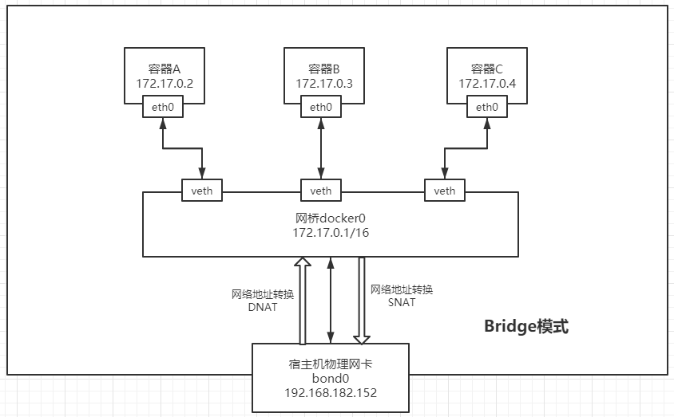
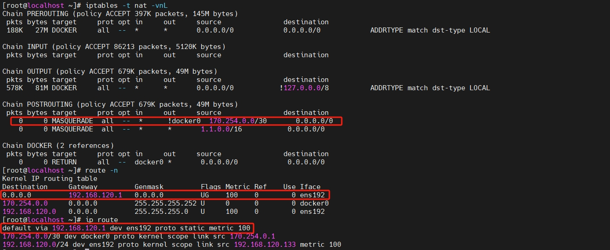
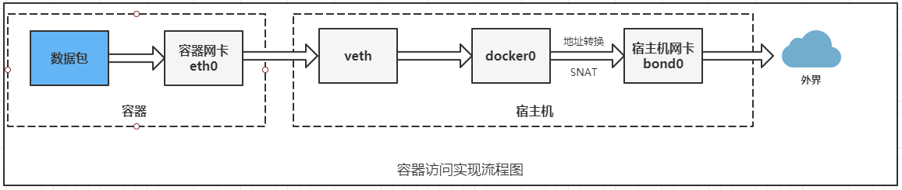
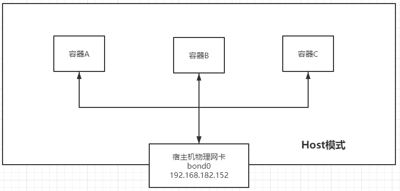
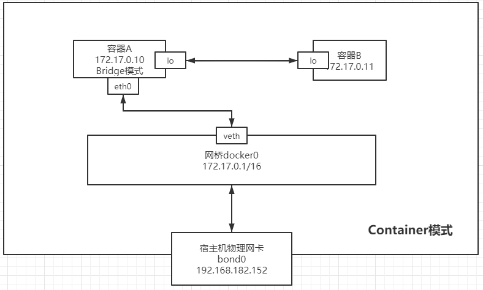

[toc]

# 简单介绍

## Docker 和虚拟机的区别


## 为什么要使用 Docker

* 简化配置
  容器镜像打包完成后，它就是个独立的个体了，丢到哪里都能跑，而无需针对各个平台去独立配置
* 提高开发效率
  可以快速搭建开发环境、让开发环境贴近生产线
* 隔离应用
  在一台服务器上运行多个不同的应用

## 镜像（Image）

* Docker 镜像是一种特殊的文件系统，除了提供容器运行时所需的程序、库、资源、配置等文件外，还包含一些为运行时准备的一些配置参数（如匿名卷、环境变量、用户等）
* 利用 Union FS 的技术，将其设计为分层存储的架构。 镜像实际是由多层文件系统联合组成。前一层是后一层的基础。每一层构建完就不会再发生改变，后一层上的任何改变只发生在自己这一层，docker支持的有OverlayFS,AUFS, Btrfs, CFS,ZFS 和 Device Mapper等

## 容器（Container）


* 镜像和容器的关系，就像是面向对象程序设计中的类和实例一样，镜像是**静态的定义**，容器是**镜像运行时的实体**。容器可以被创建、启动、停止、删除、暂停等
* 容器的实质是**进程**，但与直接在**宿主机**执行的进程不同，容器进程运行于属于自己的**独立的命名空间**
* 容器存储层的生命周期和容器一样，**容器消亡时，容器存储层也随之消亡**，因此，任何保存于容器存储层的信息都会随容器删除而丢失

## 仓库（Repository）

* 集中存储、分发镜像的服务
* 一个 Docker Registry 中可以包含多个仓库，每个仓库可以包含多个标签，每个标签对应一个镜像
* 通过<仓库名>:<标签>的格式来指定具体是这个软件哪个版本的镜像。如果不给出标签，将以 latest 作为默认标签

需要注意的是，在仓库服务器上执行 docker images 命令，查看的是它本地的镜像，而不是仓库里的镜像

# 安装 docker

Docker CE 即社区免费版，Docker EE 即企业版，强调安全，但需付费使用

## 安装前置条件

* 64位CPU架构的计算机
* Linux3.8以上内核
* 内核至少支持其中一种存储驱动：Device Manager（默认）; AUFS; vfs; btrfs
* 内核必须支持并开启cgroup和namespace功能

查看 Linux 内核命令

```shell
uname -r
```

## 安装过程

```shell
yum install -y yum-utils
# 添加yum源,这里添加的是阿里云的yum源
yum-config-manager  --add-repo  http://mirrors.aliyun.com/docker-ce/linux/centos/docker-ce.repo
# 查看docker版本
yum list docker-ce --showduplicates | sort -r
# 您可以选择其他版本
yum  -y install docker-ce-20.10.12-3.el7
# 设置国内镜像加速，你也可以用自己的仓库镜像，这里是我申请的阿里云个人加速镜像
mkdir -p /etc/docker
tee /etc/docker/daemon.json <<-'EOF'
{
  "registry-mirrors": ["https://fuchp8pk.mirror.aliyuncs.com"]
}
EOF
# 导入镜像设置
systemctl daemon-reload
# 启动docker
systemctl restart docker
# 设置docker开机启动
systemctl enable docker
# 查看docker信息
docker info
```

# docker 使用

## 制作镜像

编写dockerfile

```shell
# 引用需要的基础镜像
FROM openjdk:11

RUN echo "Asia/Shanghai" > /etc/timezone

ARG JAR_FILE=./*.jar
ENV JAVA_OPTIONS=-Xmx512m
COPY ${JAR_FILE} /app.jar

CMD java ${JAVA_OPTIONS} -jar /app.jar
```

## 构建镜像

在 Dockerfile 文件存放的目录下，执行构建

```shell
# 最后一个 . 表示当前路径，会将当前路径下的文件发给docker引擎
docker build -t 镜像名称:镜像标签 .

# 创建容器并运行dockerfile中的cmd命令，-v 绑定一个卷：宿主机路径:容器路径，指定网络模式为host
docker run -d --network host -v /home/ensbrain/:/home/spring/ -p 宿主机端口:容器端口 --restart=always -d 镜像名称:镜像标签

# 启动已经被停止的容器
docker start CONTAINER 

# 停止一个运行中的容器
docker stop CONTAINER

# 重启容器
docker restart CONTAINER

# 删除容器
docker rm CONTAINER

# 杀掉容器
docker kill -s KILL 7a6f979bc630
```

## 其他镜像命令

```shell

# 查看符合条件的镜像
docker images 镜像名称

# 删除镜像
docker rmi -f 镜像名称:标签

# 将指定镜像保存成tar归档文件
docker save -o huaweiyun.tar huaweiyun:1.0

# 导入使用 save 命令 导出的镜像
docker load --input *.tar

# 从归档文件中创建镜像，可以指定新名字
docker import *.tar 名称:tag

# 替换镜像中的jar包，然后需要重启
docker cp ensbrain-plus-server-admin-2.1.0.jar server-admin:/app.jar

# 取出 镜像中的jar
docker exec server-admin ls
docker cp server-admin:/app.jar /root

# 登录到docker镜像仓库
docker login <仓库地址>
#1.打标签
docker tag myimage registry.example.com:5000/myimage
#2.推送
docker push registry.example.com:5000/myimage


```

## docker compose

```shell
#创建并启动
docker-compose -f docker-compose.yml up -d [container_name]
#启动
docker-compose -f docker-compose.yml start
#停止
docker-compose -f docker-compose.yml stop
#删除
docker-compose -f docker-compose.yml down
docker-compose -f docker-compose.yml down --volumes
#重启
docker-compose -f docker-compose.yml restart
#指定重启某一个或多个
docker-compose -f docker-compose.yml restart mynginx

```

## [其他命令](https://www.runoob.com/docker/docker-command-manual.html)

```shell

# 查看日志，-f 跟踪日志输出
docker logs -f CONTAINER

# 标记本地镜像，将其归入仓库
docker tag docker.s.xxxxx.top/enucp/connector-admin-starter:1.0.0.001-SNAPSHOT 192.168.0.127:5000/enucp/connector-admin-starter:1.0.0.001-SNAPSHOT

# 推镜像，不指定仓库，默认推给官方仓库
docker push 192.168.0.127:5000/enucp/connector-admin-starter:1.0.0.001-SNAPSHOT 


# 进入容器内部执行命令
docker exec -it mariadb bash
docker exec -it java程序 /bin/sh

# 获取容器/镜像的元数据
docker inspect NAME|ID
# 查看某个容器内部程序的pid
docker inspect -f {{.State.Pid}} <container>

# 查看运行状态
docker stats

# 查看某个容器正在运行的进程，pid：Java程序的进程id，ppid：容器的进程id
docker top <container>

# 根据进程pid查看该进程所属容器
docker ps -q | xargs docker inspect --format '{{.State.Pid}}, {{.Name}}' | grep pid

```

## 数据管理

### 挂载主机目录

```shell
docker run -d -P \
    --name web \
    # -v /src/webapp:/usr/share/nginx/html \
    --mount type=bind,source=/src/webapp,target=/usr/share/nginx/html \
    nginx:alpine
```

上面的命令加载主机的 /src/webapp 目录到容器的 /usr/share/nginx/html目录，使用 `inspect` 命令 查出容器信息，挂载主机目录的配置信息在 `“mounts”`下：

```json
"Mounts": [
    {
        "Type": "bind",
        "Source": "/src/webapp",
        "Destination": "/usr/share/nginx/html",
        "Mode": "",
        "RW": true,
        "Propagation": "rprivate"
    }
]
```

# 网络隔离和通信

## 四种网络模式

| 网络模式           | 简介                                                                                                                       |
| ------------------ | -------------------------------------------------------------------------------------------------------------------------- |
| Bridge（默认模式） | 此模式会为每一个容器分配、设置IP等，并将容器连接到一个docker0虚拟网桥，通过docker0网桥以及Iptables nat表配置与宿主机通信。 |
| Host               | 容器将不会虚拟出自己的网卡，配置自己的IP等，而是使用宿主机的IP和端口。                                                     |
| Container          | 创建的容器不会创建自己的网卡，配置自己的IP，而是和一个指定的容器共享IP、端口范围。                                         |
| None               | 该模式关闭了容器的网络功能，与宿主机、与其他容器都不连通的                                                                 |

安装 docker 服务，会默认创建一个 docker0 网桥，上面有一个 docker0 内部接口，它在内核层连通了其它物理或虚拟网卡，这就将所有容器和本地主机都放到一个物理网络。

```bash
[root@localhost ~]# docker network ls
NETWORK ID     NAME      DRIVER    SCOPE
5cdbd1c55119   bridge    bridge    local
15e07f15a0a5   host      host      local
a959f73d2e38   none      null      local
```

Docker 安装时会自动在 host 上创建三个网络：none，host，和bridge。我们看下docker0 网桥：(brctl可以通过yum install bridge-utils -y安装)

```bash
[root@localhost ~]# brctl show
bridge name     bridge id               STP enabled     interfaces
docker0         8000.02423310c752       no

```

## Bridge 模式

当Docker server启动时，会在主机上创建一个名为 **docker0的虚拟网桥** ，此主机上启动的Docker容器会连接到这个虚拟网桥上。

**虚拟网桥的工作方式和物理交换机类似，这样主机上的所有容器就通过交换机连在了一个二层网络中** 。



当创建一个 Docker 容器的时候，同时会创建了一对 veth pair接口（当数据包发送到一个接口时，另外一个接口也可以收到相同的数据包）。这对接口一端在容器内，即 eth0；另一端在本地并被挂载到docker0 网桥，名称以 veth 开头（例如 vethAQI2QT）。通过这种方式，主机可以跟容器通信，容器之间也可以相互通信。Docker 就创建了在主机和所有容器之间一个虚拟共享网络


### Docker NAT iptables实现内外网络通信原理

> 默认情况下，容器可以主动访问到外部网络的连接，但是外部网络无法访问到容器

【注意】如果容器的宿主机上的ip_forward未打开，那么该宿主机上的容器则不能被其他宿主机访问
【打开转发配置】

```bash
# 临时修改
$ echo 1 >  /proc/sys/net/ipv4/ip_forward
# 永久修改
$ echo "net.ipv4.ip_forward=1" >> /etc/sysctl.conf
$ sysctl -p
```

#### 容器访问外部

> 容器所有到外部网络的连接，源地址都会被 NAT 成本地系统的 IP 地址（即docker0地址）。这是使用 iptables 的源地址伪装操作实现的。
>
> MASQUERADE：IP伪装，自动获取当前ip地址来做NAT



上述规则将所有源地址在 170.254.0.0/30网段的包（也就是从Docker容器产生的包），并且不是从docker0网卡发出的，进行源地址转换（SNAT），转换成主机网卡的地址



1、从某个IP为170.254.0.0/30容器中ping百度

2、IP包**首先从容器发往自己的默认网关docker0** ，包到达docker0后，也就到达了主机上

3、**然后会查询主机的路由表，发现包应该从主机的ens192发往主机的网关 192.168.120.1/24**

4、接着包会转发给 ens192，并从 ens192 发出去（主机的ip_forward转发应该已经打开）

5、这时候，上面的Iptable规则就会起作用， **通过MASQUERADE IP伪装，自动获取ens192 ip地址来对包做SNAT转换，将源地址换为ens192的地址** 。

这样，在外界看来，这个包就是从192.168.182.152上发出来的，Docker容器对外是不可见的


## Host 模式

与宿主机在同一个网络中，但**没有独立IP地址**

容器将不会虚拟出自己的网卡，配置自己的IP等，而是使用宿主机的IP和端口。



## Container 模式

Docker网络container模式是指定其和已经存在的某个容器共享一个 Network Namespace，此时这 **两个容器共同使用同一网卡、主机名、IP 地址，容器间通讯可直接通过本地回环 lo 接口通讯** 。**但这两个容器在其他的资源上，如文件系统、进程列表等还是隔离的**


