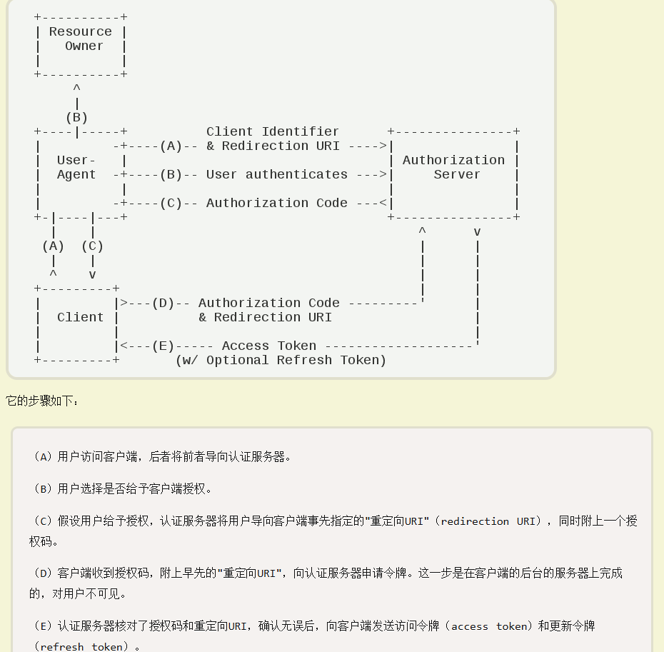

[toc]

# 基础知识

## 什么是登录认证（Authentication）

通过一定手段，对用户身份进行确认，但**HTTP是一个无状态的协议**，就是浏览器每次发送的请求都是独立的，对于服务器来说，每次请求都是**新客**。
无状态，也可以叫做无记忆，服务器不会记得你之前做了什么，他只会看到你当前的请求，所以，在Web系统中确认了用户的身份后，还需要某种机制来记住这个用户已经登录过了 — 凭证

现在流行两种登录认证方式：**Session** 和 **JWT**，无论哪种方式其原理都是Token机制，即保存凭证：
1、前端发起登录认证请求
2、后端登录认证通过，返回给前端一个凭证
3、前端发起新的请求时携带凭证

## Session

Session，是一种有状态的会话管理机制，目的就是为了解决HTTP无状态请求带来的问题

当用户登录认证请求通过时，**服务端会将用户的信息存储起来**，并**生成一个 Session Id**发送给前端，前端将这个id保存起来（一般保存在Cookie中）。之后前端发送再请求时都会携带Session Id，服务器再根据这个id检查该用户有没有登录过：


```java
    @PostMapping("login")
    public String login(@RequestBody User user, HttpSession session) {
        // 判断账号密码是否正确，这一步肯定是要读取数据库中的数据来进行校验的，这里为了模拟就省去了
        if ("admin".equals(user.getUsername()) && "admin".equals(user.getPassword())) {
            // 正确的话就将用户信息存到session中
            session.setAttribute("user", user);
            return "登录成功";
        }

        return "账号或密码错误";
    }

    @GetMapping("logout")
    public String logout(HttpSession session) {
        session.removeAttribute("user");
        return "退出成功";
    }
```

可是上面的代码也没有看到传递凭证的过程呀？因为这些工作Servlet都帮我们做好了！
如果用户第一次访问某个服务器时，服务器响应数据时会在响应头的**Set-Cookie**中将Session Id 返回给浏览器，浏览器会将标识中数据存在 Cookie 中：


浏览器后续访问服务器会携带Cookie：


每一个Session Id都对应一个HttpSession对象，然后服务器就根据你这个对象来检测这个客户端是否登录了

#### yml 配置

```yml
server:
  port: 20013
  servlet:
    context-path: /mvc
    session:
      cookie:
        name: lmc
```

此时cookie长这样：


### 过滤器

除了登录接口外，我们其他接口都要在Controller层里做登录判断，这太麻烦了。我们完全可以对每个接口过滤拦截一下，判断有没有登录，如果没有登录就直接结束请求，登录了才放行。这里我们通过过滤器来实现：

```java
@Component
public class LoginFilter extends OncePerRequestFilter {
    @Override
    protected void doFilterInternal(HttpServletRequest request, HttpServletResponse response, FilterChain filterChain) throws ServletException, IOException {
        // 简单的白名单，登录这个接口直接放行
        if ("/login".equals(request.getRequestURI())) {
            filterChain.doFilter(request, response);
            return;
        }

        // 已登录就放行
        User user = (User) request.getSession().getAttribute("user");
        if (user != null) {
            filterChain.doFilter(request, response);
            return;
        }

        // 走到这里就代表是其他接口，且没有登录
        // 设置响应数据类型为json（前后端分离）
        response.setContentType("application/json;charset=utf-8");
        PrintWriter out = response.getWriter();
        // 设置响应内容，结束请求
        out.write("请先登录");
        out.flush();
        out.close();
    }
}
```

### 上下文对象

通过SpringMvc提供的**RequestContextHolder**对象在程序任何地方获取到**当前请求对象**，从而获取保存在HttpSession中的用户对象，封装一个上下文对象来实现：

```java
public class RequestContext {

    public static HttpServletRequest getCurrentRequest() {
        // 通过`RequestContextHolder`获取当前request请求对象
        return ((ServletRequestAttributes) RequestContextHolder.currentRequestAttributes()).getRequest();
    }

    public static User getCurrentUser() {
        // 通过request对象获取session对象，再获取当前用户对象
        return (User) getCurrentRequest().getSession().getAttribute("user");
    }
}
```

## JWT(JSON Web Token)

作用：
1、将一段数据加密成字符串，也可以从这字符串解密改回数据
2、对这个字符串进行校验，有没有过期、被篡改

当用户登录成功的时候，服务器生成一个JWT字符串返回给浏览器，浏览器将JWT保存起来，在之后的请求中都携带上JWT，服务器再对这个JWT进行校验，校验通过的话就代表这个用户登录了

Session和JWT有一个重要的区别，就是**Session是有状态的，JWT是无状态的**：
Session在服务端**保存了用户信息**，而JWT没有，当前端携带Session Id到服务端时，服务端要检查其对应的 HttpSession 中有没有保存用户信息，保存了就代表登录了。
当使用JWT时，服务端只需要对这个字符串进行校验，校验通过就代表登录了。

```java
    @PostMapping("/login")
    public String login(@RequestBody User user) {
        // 判断账号密码是否正确，这一步肯定是要读取数据库中的数据来进行校验的，这里为了模拟就省去了
        if ("admin".equals(user.getUsername()) && "admin".equals(user.getPassword())) {
            // 如果正确的话就返回生成的token（注意哦，这里服务端是没有存储任何东西的）
            return JwtUtil.generate(user.getUsername());
        }
        return "账号密码错误";
    }
```

在后续会话中，用户访问其他接口时就可以校验token来判断其是否已经登录。前端将token一般会放在请求头的Authorization项传递过来，其格式一般为类型 + token。这个倒也不是一定得这么做，你放在自己自定义的请求头项也可以，只要和前端约定好就行

```java
@GetMapping("api")
public String api(HttpServletRequest request) {
    // 从请求头中获取token字符串
    String jwt = request.getHeader("Authorization");
    // 解析失败就提示用户登录
    if (JwtUtil.parse(jwt) == null) {
        return "请先登录";
    }
    // 解析成功就执行业务逻辑返回数据
    return "api成功返回数据";
}
```

### 拦截器

和之前一样，如果每个接口都要手动判断一下用户有没有登录太麻烦了，所以我们做一个统一处理，这里我们换个花样用拦截器来做：

```java
public class JwtLoginInterceptor extends HandlerInterceptorAdapter {

    @Override
    public boolean preHandle(HttpServletRequest request, HttpServletResponse response, Object handler) throws Exception {
        // 简单的白名单，登录这个接口直接放行
        if (request.getRequestURI().contains("login")) {
            return true;
        }

        // 从请求头中获取token字符串并解析
        Claims claims = JwtUtil.parse(request.getHeader("Authorization"));
        // 已登录就直接放行
        if (claims != null) {
            return true;
        }

        // 走到这里就代表是其他接口，且没有登录
        // 设置响应数据类型为json（前后端分离）
        response.setContentType("application/json;charset=utf-8");
        try (PrintWriter out = response.getWriter()) {
            // 设置响应内容，结束请求
            out.write("请先登录");
            out.flush();
        }
        return false;
    }
}

@Configuration
public class LoginConfig implements WebMvcConfigurer {

    @Override
    public void addInterceptors(InterceptorRegistry registry) {
        registry.addInterceptor(new JwtLoginInterceptor());
    }
}
```

### 上下文对象

JWT不像Session把用户信息直接存储起来，所以JWT的上下文对象要靠我们自己来实现。

```java
@UtilityClass
public class JwtContext {

    private ThreadLocal<String> user = new ThreadLocal<>();

    public void add(String userName) {
        user.set(userName);
    }

    public void remove() {
        user.remove();
    }

    /**
     * 获取当前登录用户的用户名
     *
     * @return
     */
    public String getCurrentUserName() {
        return user.get();
    }
}

public class JwtLoginInterceptor extends HandlerInterceptorAdapter {
    @Override
    public boolean preHandle(HttpServletRequest request, HttpServletResponse response, Object handler) throws Exception {
        //...省略之前写的代码

        // 从请求头中获取token字符串并解析
        Claims claims = JwtUtil.parse(request.getHeader("Authorization"));
        // 已登录就直接放行
        if (claims != null) {
            // 将我们之前放到token中的userName给存到上下文对象中
            UserContext.add(claims.getSubject());
            return true;
        }

        //...省略之前写的代码
    }

    @Override
    public void afterCompletion(HttpServletRequest request, HttpServletResponse response, Object handler, Exception ex) throws Exception {
        // 请求结束后要从上下文对象删除数据，如果不删除则可能会导致内存泄露
        UserContext.remove();
        super.afterCompletion(request, response, handler, ex);
    }
}
```

## Session、Jwt 对比

Session：

* 优点：

  * 开箱即用，简单方便
  * 能够有效管理用户登录的状态：续期、销毁等（续期就是延长用户登录状态的时间，销毁就是清楚用户登录状态，比如退出登录）
* 缺点：

  * 较JWT而言，需要额外存储数据

JWT：

* 优点：
  * 可直接解析出数据，服务端无需存储数据
  * 天然地易于水平扩展（ABC三个系统，我同一个Token都可以登录认证，非常简单就完成了单点登录）
* 缺点：
  * JWT签名的长度远比一个 Session Id长很多，增加额外网络开销
  * 无法销毁、续期登录状态
  * 秘钥或Token一旦泄露，攻击者便可以肆无忌惮操作我们的系统

其实上面说的这些优缺点都可以通过一些手段来解决，就看自己取舍了！比如Session就不易于水平扩展吗？当然不是，无论是Session同步机制还是集中管理都可以非常好的解决。
再比如JWT就真的无法销毁吗？当然也不是，其实可以将Token也在后端存储起来让其变成有状态的，就可以做到状态管理了！

软件开发没有银弹，技术选型根据自己业务需求来就好，千万不要单一崇拜某一技术而排斥其他同类技术！

## 续期管理

Session 本身采用的是发呆时间，默认用户不操作超过30分钟即失效，也就是说30 分钟内如果有访问，有效期会被刷新到 30 分钟

# 过滤器与拦截器

## 1、触发时机


### 过滤器（filter）

是在请求**进入容器后**，但在**进入servlet之前**进行预处理，请求结束返回也是，在servlet处理完之后，返回给前端之前。

Filter 源码：

```java
public void doFilter(ServletRequest request, ServletResponse response,
        FilterChain chain) throws IOException, ServletException;
```

入参是**ServletRequest**，而不是**httpservletrequest**

```java
public interface HttpServletRequest extends ServletRequest {}
```

但通常我们写过滤器，是通过继承SpringMvc封装的抽象类 `OncePerRequestFilter`

```java
protected abstract void doFilterInternal(
        HttpServletRequest request, HttpServletResponse response, FilterChain filterChain)
        throws ServletException, IOException;
```

### 拦截器（Interceptor）

是在请求**进入servlet后**，在**进入Controller之前**进行预处理，Controller中渲染了对应的视图之后请求结束。

### 小结


## 2、实现原理

### 过滤器

原理：基于函数回调
自定义的过滤器中都会有一个**doFilter()**方法，这个方法有一个**FilterChain**参数，而实际上他是一个回调接口

```java
public interface FilterChain {
    public void doFilter(ServletRequest request, ServletResponse response)
            throws IOException, ServletException;
}
```

以ApplicationFilterChain为例：


最后执行最后一个接口的doFilter方法，会走自己的实现

```java
public final class ApplicationFilterChain implements FilterChain {
    @Override
    public void doFilter(ServletRequest request, ServletResponse response) {
            ...//省略
            internalDoFilter(request,response);
    }
 
    private void internalDoFilter(ServletRequest request, ServletResponse response){
    if (pos < n) {
            //获取第pos个filter  
            ApplicationFilterConfig filterConfig = filters[pos++];  
            Filter filter = filterConfig.getFilter();
            ...
            filter.doFilter(request, response, this);
        }
    }
}
```

### 拦截器

基于Java的反射

## 3、使用范围

* 过滤器 实现的是 javax.servlet.Filter 接口，而这个接口是在Servlet规范中定义的，也就是说过滤器Filter 的使用要依赖于Tomcat等容器，导致它只能在web程序中使用
* 而拦截器(Interceptor) 它是一个Spring组件，并由Spring容器管理，并不依赖Tomcat等容器，是可以单独使用的。不仅能应用在web程序中，也可以用于Application、Swing等程序中

## 4、拦截的请求范围

同时配置过滤器、拦截器

```java
@Component
public class MyFilter implements Filter {

    /**
     * 容器启动初始化过滤器时被调用，整个生命周期只会被调用一次（这个方法必须成功，不然过滤器不会起作用）
     *
     * @param filterConfig
     * @throws ServletException
     */
    @Override
    public void init(FilterConfig filterConfig) throws ServletException {
        log.info("Filter 前置处理！！！");
    }

    /**
     * 每一次请求都会调用该方法（几乎对所有进入容器的请求起作用）
     *
     * @param request
     * @param response
     * @param chain    用来调用下一个过滤器Filter
     * @throws IOException
     * @throws ServletException
     */
    @Override
    public void doFilter(ServletRequest request, ServletResponse response, FilterChain chain) throws IOException, ServletException {
        log.info("Filter 处理中！！！");
        chain.doFilter(request, response);
    }

    /**
     * 容器销毁时，过滤器实例调用该方法，一般在方法中销毁或者关闭资源，整个生命周期也只会被调用一次
     */
    @Override
    public void destroy() {
        log.info("Filter 后置处理！！！");
    }
}

public class MyInterceptor implements HandlerInterceptor {

    /**
     * 请求处理之前（进入controller之前），进行调用
     *
     * @param request
     * @param response
     * @param handler
     * @return 返回值为false，视为该请求结束，不仅自身的拦截器会失效，还会导致其它拦截器不再执行
     * @throws Exception
     */
    @Override
    public boolean preHandle(HttpServletRequest request, HttpServletResponse response, Object handler) throws Exception {
        log.info("Interceptor 前置！！！");
        return true;
    }

    /**
     * 只有在 preHandle() 方法返回值为true 时才会执行。
     * 会在Controller 中的方法调用之后，DispatcherServlet 返回渲染视图之前被调用
     *
     * @param request
     * @param response
     * @param handler
     * @param modelAndView
     * @throws Exception
     */
    @Override
    public void postHandle(HttpServletRequest request, HttpServletResponse response, Object handler, ModelAndView modelAndView) throws Exception {
        log.info("Interceptor 处理中！！！");
    }

    /**
     * 只有在 preHandle() 方法返回值为true 时才会执行。在整个请求结束之后， DispatcherServlet 渲染了对应的视图之后执行
     *
     * @param request
     * @param response
     * @param handler
     * @param ex
     * @throws Exception
     */
    @Override
    public void afterCompletion(HttpServletRequest request, HttpServletResponse response, Object handler, Exception ex) throws Exception {
        log.info("Interceptor 后置！！！");
    }
}

```

项目启动过程中，发现过滤器的**init()**，随着容器的启动进行了初始化

随便写一个请求，后台打印日志顺序：


## 5、如何注入Bean

分别在过滤器、拦截器中注入service，发现拦截器报错了：

导致postHandle失败（http状态码虽然是200，但响应有问题）

这是因为加载顺序导致的，**拦截器**加载的时间点在**springcontext**之前，而Bean又是由spring管理的
解决方案：在注册拦截器之前，先将Interceptor手动注入

```java
@Slf4j
@Configuration
public class LoginConfig implements WebMvcConfigurer {
    @Bean
    public MyInterceptor getMyInterceptor() {
        log.info("注入了MyInterceptor！！！");
        return new MyInterceptor();
    }

    /**
     * 注册拦截器
     *
     * @param registry
     */
    @Override
    public void addInterceptors(InterceptorRegistry registry) {
        registry.addInterceptor(getMyInterceptor()).addPathPatterns("/**");
    }
}
```

# Spring Security

登录认证（**Authentication**）是对用户的身份进行确认，权限授权（**Authorization**）是对用户能否访问某个资源进行确认，授权发生都认证之后。 认证一样，这种通用逻辑都是放在过滤器里进行的统一操作：

Spring Security对Web系统的支持就是基于这一个个过滤器组成的过滤器链，用户请求都会经过 Servlet 的过滤器链


在 Servlet 过滤器链中，Spring Security 向其中添加了一个 **FilterChainProxy** 过滤器：

```java
@Override
public void doFilter(ServletRequest request, ServletResponse response,
                     FilterChain chain) throws IOException, ServletException {
    ...省略其他代码

    // 获取Spring Security的一套过滤器
    List<Filter> filters = getFilters(request);
    // 将这一套过滤器组成Spring Security自己的过滤链，并开始执行
    VirtualFilterChain vfc = new VirtualFilterChain(fwRequest, chain, filters);
    vfc.doFilter(request, response);

    ...省略其他代码
}
```

我们可以通过Debug查看当前系统中SpringSecurity过滤器链中有哪些过滤器及它们的顺序。


需要关注的是：

* UsernamePasswordAuthenticationFilter负责登录认证
* FilterSecurityInterceptor负责权限授权

**Spring Security的核心逻辑全在这一套过滤器中，过滤器里会调用各种组件完成功能，掌握了这些过滤器和组件你就掌握了Spring Security！**

# 单点登录

单点登录（Single Sign-On，简称 SSO），当用户登录一次后，即可获取所有系统的访问权限，不需要对每个单一系统逐一登录。

目前，SSO 的实现方案常见有以下几种：

1. **基于 JWT：** JWT（JSON Web Token）是一种用于在各方之间安全传递信息的开放标准，令牌中包含用户的身份信息和权限。然而，JWT 用于 SSO 时缺乏标准化方案，导致集成复杂，且令牌一旦签发无法撤销，可能影响安全性。
2. **基于 CAS：** CAS（Central Authentication Service）是一种基于中间件的开源单点登录解决方案，通常用于大学和大型企业。用户在一处登录后即可无缝访问所有与 CAS 集成的应用。但其实现较为复杂，对系统集成要求较高。
3. **基于 SAML：** SAML（Security Assertion Markup Language）是一种协议，用于在应用程序与 SSO 服务之间交换身份验证信息。它使用 XML 来交换用户标识数据，提供高安全性和灵活性，但配置和实施较为复杂，增加了开发和维护成本。
4. **基于 OIDC：** OIDC（OpenID Connect）是基于 OAuth 2.0 的身份验证层，允许用户通过多种客户端（如 Web 应用、移动应用等）进行身份验证。OIDC 具有标准化、简单易用、灵活性和安全性等优点，成为许多企业在实现单点登录时的首选。

# CAS


## 同域SSO

1、用户访问产品A，向后台服务器发送登录请求
2、登录认证成功，服务器把用户的登录信息写入session
3、服务器为该用户生成一个cookie，并加入response header，随着请求写入浏览器，该cookie的域设为 dxy.com
4、下一次，用户访问同域名的产品B时，由于A和B在同一域名，也是 dxy.com，浏览器会自动带上之前的cookie，后台就可以通过cookie来验证登录状态

## 同父域SSO

同父域 SSO 是同域 SSO 的简单升级，唯一的不同在于，服务器在返回 cookie 的时候，要把cookie 的 domain 设置为其父域。

比如两个产品的地址分别为 a.dxy.cn 和 b.dxy.cn，那么 cookie 的域设置为 dxy.cn 即可。在访问 a 和 b 时，这个 cookie 都能发送到服务器，本质上和同域 SSO 没有区别。

## 跨域SSO

可以看到，在上面两种情况下，我们都没有专门设置 SSO 服务器。但是当两个产品不同域时，cookie 无法共享，所以我们必须设置独立的 SSO 服务器了。这个时候，我们就是通过标准的 CAS 方案来实现 SSO 的

### 术语：

Client：用户。

Server：中心服务器，也是 SSO 中负责单点登录的服务器。

Service：需要使用单点登录的各个服务，相当于上文中的产品 a/b。

### 票据

* TGT：Ticket Grangting Ticket
  TGT 是 CAS 为用户签发的登录票据，拥有了 TGT，用户就可以证明自己在 CAS 成功登录过。TGT 封装了 Cookie 值以及此 Cookie 值对应的用户信息。当 HTTP 请求到来时，CAS 以此 Cookie 值（TGC）为 key 查询缓存中有无 TGT ，如果有的话，则相信用户已登录过。
* TGC：Ticket Granting Cookie
  CAS Server 生成TGT放入自己的 Session 中，而 TGC 就是这个 Session 的唯一标识（SessionId），以 Cookie 形式放到浏览器端，是 CAS Server 用来明确用户身份的凭证。
* ST：Service Ticket
  ST 是 CAS 为用户签发的访问某一 service 的票据。用户访问 service 时，service 发现用户没有 ST，则要求用户去 CAS 获取 ST。用户向 CAS 发出获取 ST 的请求，CAS 发现用户有 TGT，则签发一个 ST，返回给用户。用户拿着 ST 去访问 service，service 拿 ST 去 CAS 验证，验证通过后，允许用户访问资源。

票据之间的关系如下图。注意，PGTIOU, PGT, PT 是 CAS 2.0 中的内容，感兴趣的同学可以自行了解。

### 详细步骤

1、用户访问产品 a，域名是 www.a.cn
2、由于用户没有携带在 a 服务器上登录的 a cookie，所以 a 服务器**重定向到SSO服务器地址**，重定向的url形如：

> http://172.23.26.44:81/ssoserver/login?service=http://172.23.26.44:81/ajsl/cas

3、由于用户没有携带在SSO服务器上的**登录票据（TGC）**，SSO服务器判断用户未登录，返回给用户**统一登录页面**，在SSO页面上进行登录操作。

4、登录成功，SSO服务器构建用户在SSO登录的**TGT**，同时返回一个http重定向，

* 重定向地址为 service= 的a页面
* 重定向地址中包含sso服务器派发的ST（service 票据）
* 重定向的response中包含写 cookie 的header，这个 cookie 代表用户在 SSO 中的登录状态，它的值就是**TGC**


5、浏览器重定向到产品 a。此时重定向的 url 中携带着 SSO 服务器生成的 ST

6、**根据ST，a 服务器向 SSO 服务器发送请求，SSO 服务器验证票据的有效性**。验证成功后，**a 服务器知道用户已经在 sso 登录了**，于是 a 服务器构建用户登录 session，记为 a session。并将 cookie 写入浏览器。注意，此处的 cookie 和 session 保存的是用户在 a 服务器的登录状态，和 CAS 无关

7、之后用户访问产品 b，域名是 www.b.cn

8、由于用户没有携带在 b 服务器上登录的 b cookie，所以 b 服务器返回 http 重定向，重定向的 url 是 SSO 服务器的地址，去询问用户在 SSO 中的登录状态

9、浏览器重定向到 SSO。注意，**第 4 步中已经向浏览器写入了携带 TGC 的cookie**，所以此时 SSO 服务器可以拿到，根据 TGC 去查找 TGT，如果找到，就判断用户已经在 sso 登录过了

10、SSO 服务器返回一个重定向，重定向携带 ST。注意，这里的 ST 和第4步中的 ST 是不一样的，事实上，每次生成的 ST 都是不一样的

11、浏览器带 ST 重定向到 b 服务器，和第 5 步一样

12、b 服务器根据票据向 SSO 服务器发送请求，票据验证通过后，b 服务器知道用户已经在 sso 登录了，于是生成 b session，向浏览器写入 b cookie

如图所示，至此，整个登录流程结束。之后当用户访问 a 或者 b 后，直接会携带 a cookie/b cookie，就不用再向 SSO 确认了

### 示例

> x.x.120.130 客户端
>
> x.x.114.199 认证服务器
>
> 访问客户端：
>
> https://x.x.120.130:58679/enclient/api/users/admin/custom/page/login/sso/cas
>
> 302>
>
> https://x.x.114.199:58679/enclient/api/users/sso/202503121528381899724197559259477000/cas/login?service=https://x.x.120.130:58679/enclient/api/users/auth/cas/callback
>
> 302，并且认证服务器会把回调地址写入cookie：
>
> https://x.x.114.199:58679/enclient 登录页面，登录完成
>
> 302>
>
> https://x.x.120.130:58679/enclient/api/users/auth/cas/callback?ticket=ST-dad29bc7-95f8-4ec1-a894-b58583c4faa0
>
> 客户端收到ticket后，后台去校验，调用认证中心接口：
>
> https://x.x.114.199:58679/enclient/api/users/sso/202503121528381899724197559259477000/cas/p3/serviceValidate?ticket=ST-dad29bc7-95f8-4ec1-a894-b58583c4faa0&service=https://x.x.120.130:58679/enclient/api/users/auth/cas/callback
>
> 得到响应：
>
> ```xml
> <cas:serviceResponse xmlns:cas='http://www.yale.edu/tp/cas'>
>     <cas:authenticationSuccess>
>         <cas:user>lvmcas</cas:user>
>            <cas:attributes>
>                <cas:name>lvmcas</cas:name>
>                <cas:username>lvmcas</cas:username>
>                <cas:mobile></cas:mobile>
>                <cas:email></cas:email>
>            </cas:attributes>    </cas:authenticationSuccess>
> </cas:serviceResponse>
>
> ```

# OAuth2.0

[OAuth 2.0 的四种方式 - 阮一峰的网络日志](https://www.ruanyifeng.com/blog/2019/04/oauth-grant-types.html)



## 示例

> x.x.114.140 客户端
>
> x.x.114.199 认证服务器
>
> A、访问客户端，重定向到认证服务器
>
> https://x.x.114.140:58679/enclient/api/users/admin/custom/page/login/sso/oauth
>
> 302 >
>
> https://x.x.114.199:58679/enclient/api/users/sso/202503111040481899289375128932513000/oauth/login?client_id=202503111040481899289375128932514000&redirect_uri=https://x.x.114.140:58679/enclient/api/users/auth/oauth/callback&scope=user&response_type=code&state=LVMC_OAUTH
>
> 302 >
>
> B、C 授权
>
> https://x.x.114.199:58679/enclient 登录页，登录完成
>
> 302 >
>
> D1、客户端收到授权码
>
> https://x.x.114.140:58679/enclient/api/users/auth/oauth/callback?code=607719&state=LVMC_OAUTH
>
> D2、向服务器申请令牌（在客户端后台调用）
>
> https://x.x.114.199:58679/enclient/api/users/sso/202503121528381899724197559259477000/oauth/login/code?code=%s&grant_type=authorization_code&clientId=%s&clientSecret=%s&redirect_uri=%s
>
> E、认证服务器核对授权码和重定向uri，确认无误后，返回令牌（access_token）
>
> 最后用令牌去查询用户

# OIDC
