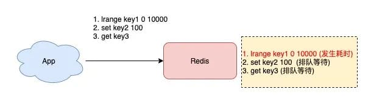
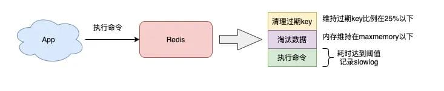

# 性能优化

## 网络延迟

```sh
$ redis-cli -h 127.0.0.1 -p 6379 --intrinsic-latency 60
Max latency so far: 1 microseconds.
Max latency so far: 15 microseconds.
Max latency so far: 17 microseconds.
Max latency so far: 18 microseconds.
Max latency so far: 31 microseconds.
Max latency so far: 32 microseconds.
Max latency so far: 59 microseconds.
Max latency so far: 72 microseconds.
 
1428669267 total runs (avg latency: 0.0420 microseconds / 42.00 nanoseconds per run).
Worst run took 1429x longer than the average latency.
```

可以看到，这 60 秒内的最大响应延迟为 72 微秒（0.072毫秒）

## 命令复杂度过大

```sh
# 命令执行耗时超过 5 毫秒，记录慢日志
CONFIG SET slowlog-log-slower-than 5000
# 只保留最近 500 条慢日志
CONFIG SET slowlog-max-len 500


127.0.0.1:6379> SLOWLOG get 5
1) 1) (integer) 32693       # 慢日志ID
   2) (integer) 1593763337  # 执行时间戳
   3) (integer) 5299        # 执行耗时(微秒)
   4) 1) "LRANGE"           # 具体执行的命令和参数
      2) "user_list:2000"
      3) "0"
      4) "-1"
2) 1) (integer) 32692
   2) (integer) 1593763337
   3) (integer) 5044
   4) 1) "GET"
      2) "user_info:1000"
```

* 如果经常执行O(N)复杂度以上的命令：SORT、SUNION，导致Redis操作内存数据时花费更多的cpu资源
* 一次性返回给客户端的数据过多，花费在数据协议的组装和网络传输过程中

由于redis单线程处理客户端请求，一旦某个命令发生耗时，导致后面的请求排队，响应延迟也会变长



### 优化方法

针对这两种情况，可以使用以下方法来优化：

* 尽量不使用 O(N) 以上复杂度过高的命令，对于数据的聚合操作，放在客户端做
* 执行 O(N) 命令，保证 N 尽量的小（推荐 N <= 300），每次获取尽量少的数据，让 Redis 可以及时处理返回

## BigKey

> 查询慢日志发现，并不是复杂度过高的命令导致的，而都是 SET / DEL 这种简单命令出现在慢日志中，那么你就要怀疑你的实例否写入了 bigkey。

Redis 在写入时，需要为新的数据分配内存，删除时，要释放相应的内存空间。

如果一个key非常大，分配内存时就会比较耗时

```sh
redis-cli -h 127.0.0.1 -p 6378 -a enlink --bigkeys -i 0.01
```

这个命令的原理，就是使用了 SCAN 命令，遍历所有 key，然后针对 key 的类型，分别执行 STRLEN、LLEN 等，来获取长度

但这种方式会导致 redis 的OPS突增

### 优化方法

* 业务尽量避免使用 bigkey
* Redis 4.0以上版本，用 UNLINK 代替 DEL，此命令可以把释放 key 内存的操作，放到后台线程中去执行，从而降低对 Redis 的影响
* Redis 6.0以上版本，可以开启 lazy-free 机制（lazyfree-lazy-user-del = yes），在执行 DEL 命令时，释放内存也会放到后台线程中执行

## 集中过期

> 某个节点突然出现一波延迟，**变慢的时间点很规律**，那有可能是因为大量的key集中过期

### Redis 过期策略

* 被动过期：当访问某个 key 的时候，判断这个 key 是否过期
* 主动过期：Redis 内部维护了一个定时任务，每隔100ms，从全局的过期哈希表中随机取20个key，删除其中过期了，如果删除比例超过25%，则重复此过程，或者这次的任务耗时超过了25毫秒，才会退出循环

**这个定时任务，是在 Redis 主线程中执行的**

也就是说，此时客户端访问 Redis 时，必须等待过期任务执行结束，Redis 才会响应这个客户端请求

此时，客户端访问 Redis 延迟会变大

### 优化方法

* 集中过期 key 增加一个随机过期时间，把集中过期时间打散
* Redis 6.0以上版本，可以开启 lazy-free 机制（lazyfree-lazy-user-del = yes），在执行 DEL 命令时，释放内存也会放到后台线程中执行


## 内存达到上限

一般会给 Redis 设置内存上限：maxmemory，以及数据淘汰策略。

当实例的内存达到 maxmemory 后，每次写入新数据，操作延迟可能变大了

因为每次写入新数据之前，必须先从实例中踢出一部分数据，踢数据也需要消耗时间，消耗时间的长短，取决于配置的淘汰策略：

* `allkeys-lru`：不管 key 是否设置了过期，淘汰最近最少访问的 key
* `volatile-lru`：只淘汰最近最少访问、并设置了过期时间的 key

需要注意的是，Redis 的淘汰数据的逻辑与删除过期 key 的一样，也是在命令真正执行之前执行的，也就是说它也会增加我们操作 Redis 的延迟，而且，写 OPS 越高，延迟也会越明显。



### 优化方法

* 避免存储 bigkey，降低释放内存的耗时
* 淘汰策略改为随机淘汰，随机淘汰比 LRU 要快很多（视业务情况调整）
* 拆分实例，把淘汰 key 的压力分摊到多个实例上
* 如果使用的是 Redis 4.0 以上版本，开启 layz-free 机制，把淘汰 key 释放内存的操作放到后台线程中执行（配置 lazyfree-lazy-eviction = yes）


## fork 耗时

> Redis 后台 RDB 和 AOF rewrite 期间，Redis 延迟变大

rewrite 时，主进程通过调用操作系统的fork，创建一个子进程进行数据持久化。

在 fork 执行过程中，主进程需要拷贝自己的内存页表给子进程，如果实例过大，拷贝的过程也会比较耗时，并且 fork 会消耗大量 CPU

在完成 fork 之前，整个 Redis 实例会被阻塞，无法处理客户端请求

可以在 Redis 上执行 INFO 命令，查看 latest_fork_usec 项，单位微秒。


```sh
# 上一次 fork 耗时，单位微秒
latest_fork_usec:59477
```

这个时间就是主进程在 fork 子进程期间，整个实例阻塞无法处理客户端请求的时间

### 优化方法

* 控制实例的大小，实例越大，耗时越久
* 低峰期，在 slave节点执行备份，


## AOF

aof 工作原理：

* Redis 执行写命令后，把这个命令写入到 AOF 文件内存中（write 系统调用）
* Redis 根据配置的 AOF 刷盘策略，把 AOF 内存数据刷到磁盘上（fsync 系统调用）

三种刷盘机制：

* appendfsync always：主线程每次执行写操作后立即刷盘，此方案会占用比较大的磁盘 IO 资源，但数据安全性最高
* appendfsync no：主线程每次写操作只写内存就返回，内存数据什么时候刷到磁盘，交由操作系统决定，此方案对性能影响最小，但数据安全性也最低，Redis 宕机时丢失的数据取决于操作系统刷盘时机
* appendfsync everysec：主线程每次写操作只写内存就返回，然后由后台线程每隔 1 秒执行一次刷盘操作（触发fsync系统调用），此方案对性能影响相对较小，但当 Redis 宕机时会丢失 1 秒的数据


# 面试问题
