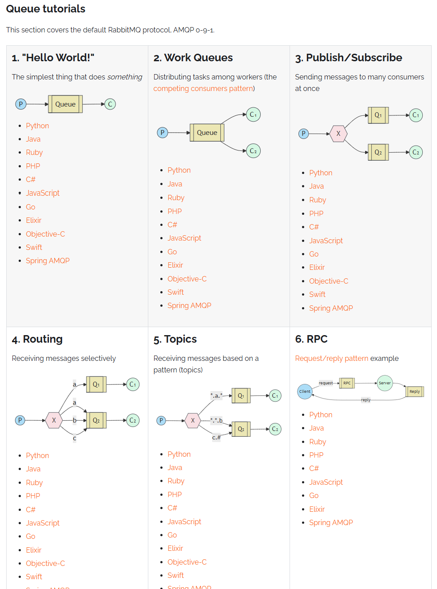
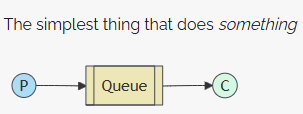
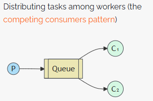
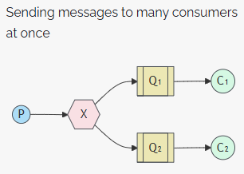
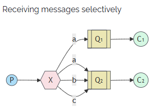
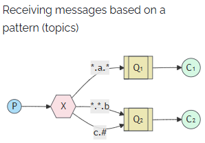
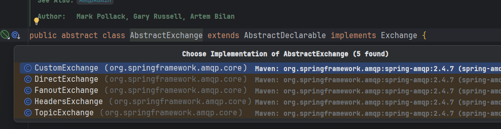
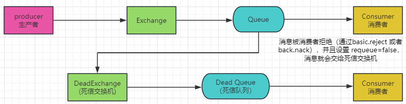

# 参考文档

[https://www.rabbitmq.com](https://www.rabbitmq.com)

[SpringBoot RabbitMQ 七种工作模式入门SpringBoot RabbitMQ 七种工作模式入门，简单介 - 掘金](https://juejin.cn/post/6949924094800297997?from=search-suggest#heading-8)

# AMQP 协议

控制面板

http://192.168.112.157:15672/

# 五种消息模型

## Hello World

又称为 *“点对点模式”*、*“简单模式”*

P：生产者

C：消费者

只有一个队列

## Worker

其实和Hello World一样的，只是多了一个消费者

当有多个消费者时，默认使用轮询机制把消息分配给消费者

## Publish/Subscribe

> 其实 Publish/Subscribe、Routing、Topics 都是订阅模型，本质上是根据交换机（Exchange）的类型划分的

Publish/Subscribe 即 Fanout（广播） 模型，将消息发送给交换机的所有队列，所有消费者都能收到

## Routing

即 Direct（直连）模型: 把消息发送给拥有指定Routing Key (路由键)的队列

P：生产者，向 Exchange 发送消息，发送消息时，会**指定一个 routing key**

X：Exchange（交换机），接收生产者的消息，然后把消息递交给**与 routing key 完全匹配的队列**

C1：消费者，其所在队列指定了需要 routing key 为 a 的消息

C2：消费者，其所在队列指定了需要 routing key 为 a、b、c 的消息

拥有不同的 RoutingKey 的消费者，会收到来自交换机不同的信息

## Topics

即 Topic（通配符）: 把消息传递给拥有 符合Routing Patten(路由模式)的队列。

类似于Direct模型。区别是Topic的Routing Key支持通配符。

# 交换机视角

> RabbitMQ 消息传递模型中的核心思想是生产者从不将任何消息直接发送到队列。实际上，生产者根本不知道是否将消息传递到任何队列。
>
> 相反，生产者只能将消息发送到交换机。在这种模型下，生产者从不将任何消息直接发送到队列，而是发送到交换机。
>
> 生产者 -> 交换机 -> 队列 -> 消费者

| 消息模式                                                     | 交换机                | 消费逻辑               |
| ------------------------------------------------------------ | --------------------- | ---------------------- |
| Simple Work Queue （简单工作队列），Work Queues （工作队列） | 空交换机              | 单个消费               |
| Publish/Subscribe （发布订阅模式）                           | fanout （扇形交换机） | 多个消费者都会接收消息 |
| Routing（路由模式）                                          | direct （直连交换机） | 有选择的接收消息       |
| Topics（主题模式）                                           | topic（主题交换机）   | 通过一定规则来接收消息 |

# 死信队列

## 什么是死信队列

死信队列（DLX）是 RabbitMQ 中的一种机制，用于将无法正常消费的消息转发到一个指定的队列。这些消息可能因为以下原因被视为死信：

* 消息被消费者拒绝（通过basic.reject 或者 back.nack），并且设置 requeue=false
* 消息过期，因为队列设置了TTL（Time To Live）时间
  * 发送消息时设置消息的生存时间
  * 某个队列中所有消息的生产时间
* 消息被丢弃，因为超过了队列的长度限制

> 死信队列的核心作用：这些条件下，消息会被转发到一个单独的队列（也就是死信队列），在死信队列来存储这些消息

# 延时队列

延时队列，可以通过死信队列来实现。

* 通过设置队列的ttl，来控制消息的生存时间（即延迟时间），当消息的过期时间到了，消息会被认为是死信
* 当消息过期之后，会被路由到死信队列，可以把死信队列绑定到另一个队列，进一步处理这些死信
