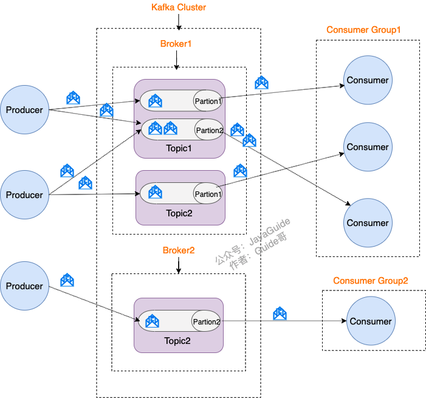
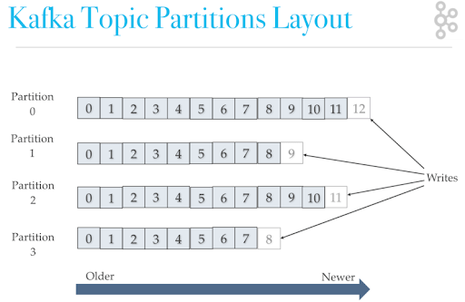

[toc]

# 安装

```sh
docker pull wurstmeister/zookeeper
docker pull wurstmeister/kafka

docker run -d -p 2181:2181 -v /root/docker/zookeeper/data:/data/ --name zookeeper --privileged zookeeper的imageId
```

```yml
version: "3.5"

services:
  zookeeper:
    image: wurstmeister/zookeeper:latest
    container_name: zookeeper
    restart: always
    network_mode: host
    environment:
      ZOO_ADMINSERVER_ENABLED: "false"
      TZ: Asia/Shanghai
    volumes:
      - /etc/localtime:/etc/localtime
      - ./conf/zoo_single.cfg:/conf/zoo.cfg
      - ./data:/data
      - ./datalog:/datalog


version: "3.5"

services:
  ## ======================= Kafka(v2.11-1.0.0) =========================
  kafka:
    image: wurstmeister/kafka:latest
    container_name: kafka
    restart: always
    network_mode: host
    entrypoint: /bin/sh -c 'sleep 30 && start-kafka.sh'
    environment:
      KAFKA_BROKER_ID: 1
      KAFKA_LISTENERS: PLAINTEXT://0.0.0.0:9092
      KAFKA_ADVERTISED_LISTENERS: PLAINTEXT://kafka:9092
      KAFKA_ZOOKEEPER_CONNECT: zookeeper:2181
      TZ: Asia/Shanghai
    ulimits:
      nofile:
        soft: "65536"
        hard: "65536"
```

# 原理

## 术语

* 消息：Record，Kafka 处理的主要对象
* 主题：Topic，承载消息的逻辑容器，实际用来区分具体的业务
* 分区：Partition，一个有序不变的消息序列，每个主题下可以有多个分区
* 消息位移：Offset，分区中每条消息的位置信息，单调递增且不变
* 副本：Replica，Kafka 中同一条消息能够被拷贝到多个地方以提供数据冗余，这些地方就是副本。副本在分区层级下，即每个分区可配置多个副本实现高可用
* 生产者：Producer，向主题发布新消息的程序
* 消费者：Consumer，从主题订阅新消息的程序
* 消费者位移：Consumer Offset，表征消费者消费进度，每个消费者都有自己的消费者位移
* 消费者组：Consumer Group，多个消费者实例共同组成的一个组，同时消费多个分区以实现高吞吐
* 重平衡：Rebalance，消费者组内某个消费者实例挂掉后，其他消费者实例自动重新分配订阅主题分区的过程


## 分区

Kafka的消息组织方式实际上是三级结构：主题-分区-消息
主题下的每条消息只会保存在某一个分区中，而不会在多个分区中被保存多份。


### 为什么要使用分区

实现高伸缩性，不同分区能够被放置到不同节点的机器上，而数据的读写操作也都是针对分区这个粒度进行的，这样每个节点的机器都能独立地执行各自分区的读写请求处理，
可以通过增加机器来增加整体的吞吐量

### 分区策略

所谓分区策略是决定生产者将消息发送到哪个分区的算法。

* 轮询策略
  即顺序分配，是默认策略
* 随机策略
* 按消息建保存策略

### 如何保证顺序消费

Kafka 中消息的顺序性是基于分区（Partition）的，也就是说，在同一个分区中的消息是按照顺序进行消费的

1. **生产者发送消息时指定键（Key）** ：Kafka 会基于这个键进行分区（Partition）的分配，这样相同键的消息会被发送到同一个分区，从而保证这些消息在一个分区内是有序的。
2. **消费者按分区消费** ：消费者在消费消息时是按分区进行的，消费同一个分区中的消息会按照消息的顺序进行消费

## 无消息丢失配置


## 消费者组


组内多个消费者共享一个**公共的ID，即 Group ID**。组内所有消费者协调在一起消费订阅主题（Subscribed Topics）的所有分区（Partition）。
每个分区只能由**同一个消费者组内的一个Consumer**实例来消费。

1、Consumer Group 下可以有一个或多个Consumer实例。这里的实例可以是一个单独的进程，也可以是同一进程下的线程。在实际场景中，使用进程更为常见一些。
2、Group ID是一个字符串，在一个Kafka集群中，它标识唯一的一个Consumer Group
3、Consumer Group下所有实例订阅的主题的单个分区，只能分配给组内的某个Consumer实例消费。这个分区当然也可以被其他的Group消费。

点对点消息队列模型缺陷在于消息一旦被消费，就会从队列中删除，而且只能被下游的一个Consumer消费。
发布/订阅模型允许消息被多个Consumer消费，但它的问题也是伸缩性不高，因为每个订阅者都必须要订阅主题的所有分区。这种全量订阅的方式既不灵活，也会影响消息的真实投递效果。

Kafka 的 Consumer Group订阅多个主题后，组内的每个实例不要求一定要订阅主题的所有分区，它只会消费部分分区中的消息。
**Kafka仅仅使用Consumer Group这一种机制，却同时实现了传统消息引擎系统的两大模型**：如果所有实例都属于同一个Group，那么它实现的就是消息队列模型；如果所有实例分别属于不同的Group，那么它实现的就是发布/订阅模型。

**理想情况下，Consumer实例的数量应该等于该Group订阅主题的分区总数。**

实际使用过程中，一般不推荐设置大于总分区数的Consumer实例，设置多余的实例只会浪费资源，没有任何好处。

### 位移管理

消费者在消费过程中需要记录自己消费了多少数据，即消费位置消息。
对于 Consumer Group 而言，它是一组KV对，Key 是分区，V 对应Consumer消费该分区的最新位移。
它们保存在Broker端内部主题中：__consumer_offsets。

### 重平衡(Rebalance)

**Rebalance本质上是一种协议，规定了一个Consumer Group下的所有Consumer如何达成一致，来分配订阅Topic的每个分区。**
比如某个Group下有20个Consumer实例，它订阅了一个具有100个分区的Topic。正常情况下，Kafka平均会为每个Consumer分配5个分区。这个分配的过程就叫Rebalance。

Rebalance的触发条件有3个：

1. 组成员数发生变更。比如有新的Consumer实例加入组或者离开组，抑或是有Consumer实例崩溃被“踢出”组
2. 订阅主题数发生变更。
3. 订阅主题的分区数发生变更。Kafka当前只能允许增加一个主题的分区数。当分区数增加时，就会触发订阅该主题的所有Group开启Rebalance。

Rebalance过程类似于 GC，而且太慢，最好的解决方案就是避免Rebalance的发生

## 位移


__consumer_offsets在Kafka源码中有个更为正式的名字，叫位移主题，即Offsets Topic。
将Consumer的位移数据作为一条条普通的Kafka消息，提交到__consumer_offsets中。
这个消息的格式是一个KV对，**Key中保存3部分内容 \<Group ID，主题名，分区号>**。
可以简单认为消息体就保存了位移值。

当Kafka集群中的第一个Consumer程序启动时，Kafka会自动创建位移主题。
Broker端参数offsets.topic.num.partitions来控制分区数，默认值是50

### 使用位移主题

Kafka Consumer 提交位移时，会写入该主题，目前Kafka Consumer 提交位移的方式有两种：自动提交、手动提交位移

### 自动提交

Consumer端有个参数叫enable.auto.commit，如果值是true，则Consumer在后台默默地为你定期提交位移，提交间隔由一个专属的参数auto.commit.interval.ms来控制。
这会存在一个问题，只要Consumer一直启动着，它就会无限期地向位移主题写入消息。
假设Consumer当前消费到了某个主题的最新一条消息，位移是100，之后该主题没有任何新消息产生，故Consumer无消息可消费了，所以位移永远保持在100，由于是自动提交位移，位移主题中会不停写入位移=100的消息。显然Kafka只需要保留这类消息中的最新一条，之前的消息都要删除，不然会撑爆磁盘。

Kafka使用**Compact策略**来删除位移主题中的过期消息。
对于同一个key的两条消息M1和M2，如果M1的发送时间早于M2，那么M1就是过期消息。Compact 的过程就是扫描日志的所有消息，剔除那些过期的消息，然后把剩下的消息整理在一起。


图中位移为0、2和3的消息的Key都是K1。Compact之后，分区只需要保存位移为3的消息，因为它是最新发送的。
Kafka提供了专门的后台线程定期地巡检待Compact的主题，看看是否存在满足条件的可删除数据。这个后台线程叫Log Cleaner。很多实际生产环境中都出现过位移主题无限膨胀占用过多磁盘空间的问题，如果你的环境中也有这个问题，我建议你去检查一下Log Cleaner线程的状态，通常都是这个线程挂掉了导致的。

### 手动提交

手动提交位移，即设置enable.auto.commit = false。

## 消费

对于Kafka消费者来说，最重要的事情就是监控它们消费的滞后程度。这个滞后程度有个专门的名称：消费者Lag
通常来说，Lag的单位是消息数，而且我们一般是在主题这个级别上讨论Lag的，但实际上，Kafka监控Lag的层级是在分区上的。如果要计算主题级别的，你需要手动汇总所有主题分区的Lag，将它们累加起来，合并成最终的Lag值。

LAG值 = 每个分区当前最新生产的消息的位移值（即LOG-END-OFFSET列值）-该消费者组当前最新消费消息的位移值（即CURRENT-OFFSET值）


## 副本

副本的概念是在分区层级下的，每个分区配置有若干个副本。
**副本(Replica)，本质就是一个只能追加写消息的提交日志**同一分区下的所有副本保存相同的消息序列，这些副本分散保存在不同的Broker上，从而能够对抗部分Broker宕机带来的数据不可用。


# 命令

```sh
# 查看topic版本 kafka_2.11-2.0.1.jar（2.11为scala版本，2.0.1为kafka版本）
ls /opt/kafka_2.11-2.0.1/libs

# 查看topic列表
sh kafka-topics.sh --zookeeper localhost:2181 --list

# 创建topic（2.2.0版本前后命令有差异）
sh kafka-topics.sh --zookeeper 127.0.0.1:2181 --create --partitions 10 --replication-factor 1 --topic [name]

# 查看topic详细信息
sh kafka-topics.sh --zookeeper localhost:2181 --describe --topic [name]
# 查看Topic的分区数
sh kafka-topics.sh --describe --bootstrap-server localhost:9092 --topic [name]

# 发送消息
sh kafka-console-producer.sh --broker-list 127.0.0.1:9092 --topic [name]

# 接收消息
sh kafka-console-consumer.sh --bootstrap-server 127.0.0.1:9092 --topic [name] --from-beginning

 ##偏移量
sh kafka-console-consumer.sh --bootstrap-server 127.0.0.1:9092 --topic [name] --from-beginning

# 查看消费者列表
sh kafka-consumer-groups.sh --bootstrap-server 127.0.0.1:9092 --list

# 查看消费者详情
sh kafka-consumer-groups.sh --bootstrap-server 127.0.0.1:9092 --describe --group [name]

# TOPIC(主题) PARTITION(分区)  CURRENT-OFFSET(该消费者组当前最新消费消息的位移值)  LOG-END-OFFSET(每个分区当前最新生产的消息的位移值)  LAG(前两者的差值) CONSUMER-ID(消费者实例ID)  CLIENT-ID

```

# 开发

## 使用ConsumerRecord类消费

ConsumerRecord类里面包含分区信息、消息头、消息体等内容，如果业务需要获取这些参数时，使用ConsumerRecord会是个不错的选择。如果使用具体的类型接收消息体则更加方便，比如说用String类型去接收消息体

```java
    @KafkaListener(id = "consumer", topics = "topic1")
    public void consumerListener(List<ConsumerRecord<String, String>> records) {
    
    }
```

## 使用Ack机制确认消费

Kafka 通过最新保存的偏移量进行消息消费的，而且确认消费的消息并不会立刻删除。
Kafka的ack 机制可以有效的确保消费不被丢失。因为自动提交是在kafka拉取到数据之后就直接提交，这样很容易丢失数据
使用Kafka的Ack机制比较简单，只需简单的三步即可：

1、设置ENABLE_AUTO_COMMIT_CONFIG=false，禁止自动提交
2、设置AckMode=MANUAL_IMMEDIATE
3、监听方法加入Acknowledgment ack 参数

## 解决重复消费


# 面试问题

## Kafka用的是什么模型

发布-订阅模型



## 消费顺序

经常有业务场景需要严格保证消息的消费顺序。

Kafka 中 Partition(分区)是真正保存消息的地方，而我们的 Partition(分区) 又存在于 Topic(主题) 这个概念中，并且我们可以给特定 Topic 指定多个 Partition。



Kafka 会基于这个键进行分区（Partition）的分配，这样相同键的消息会被发送到同一个分区，从而保证这些消息在一个分区内是有序的。

## 消息丢失


* acks=all，代表所有副本接收，生产者才会收到来自服务器的响应
* 

## 如何保证不重复消费

出现重复消息的原因：

* 服务端侧已经消费的数据没有成功提交 offset（根本原因）

解决方案：

* 消费者做幂等校验
* 关闭自动提交offset，每次消费完成再手动提交offset

## 重试机制

### 消费失败会怎么样？

问：消费过程中，有一个消息消费异常，会不会卡住后续队列的消费？导致业务卡住？

答：消费异常会进行重试，重试多次后会跳过当前消息，继续后续消息的消费，不会一直卡在当前消息。
