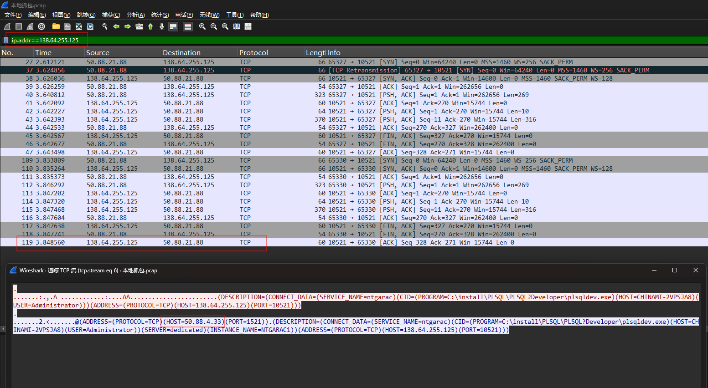

# 背景

原需求：控制器查询对方 Oracle 的数据

控制器服务器：138.64.255.2

Oracle服务器：138.64.255.125，端口：10521

代码：

```java
        String url = dbConfig.getUrl();
        log.info("南通公安数据导入，数据库连接信息，{}", url);
        DriverManagerDataSource dataSource = new DriverManagerDataSource();
        dataSource.setDriverClassName("oracle.jdbc.driver.OracleDriver");
        dataSource.setUrl(url);
        dataSource.setUsername(dbConfig.getUsername());
        dataSource.setPassword(dbConfig.getPassword());
```

服务报错：


# 排查过程

## 初步确认网络环境

* 从 138.64.255.2 telnet 138.64.255.125 10521 能通
* 现场某台 Windows 电脑上可以通过 psql 可以连接 Oracle

从以上两点可以明确对方 Oracle 可用，并且我们服务器能连通 Oracle 数据库

## 控制变量，服务器问题or代码问题

如果我们服务器上直接连上 Oracle，说明是代码问题

否则，说明服务器和Oracle通信存在某些问题

安装了一个 sqlplus：


这个报错是因为他的密码里有@，遂让他们修改数据库密码


这个报错的官网解释：


这个时候，我才注意看这个 TNS

## Oracle 连接方式有限制？

[JDBC连接ORACLE的三种URL格式_oracle jdbc url 格式-CSDN博客](https://blog.csdn.net/u012062455/article/details/52442838)

简单来说，Oracle 有三种连接方式：SID、SERVICE NAME、TNS

我之前给的是 SERVICE NAME 的连接方式：

> sqlplus zht/zht2023@138.64.255.125:10521/ntgarac

是不是，他们设置了只允许 TNS 连接，于是改成：

> sqlplus zht/zht2023@(DESCRIPTION=(ADDRESS=(PROTOCOL=TCP)(HOST=138.64.255.125)(PORT=10521))(CONNECT_DATA=(SERVICE_NAME=ntgarac)(SERVER=dedicated)))


## 网络问题？

最后报错，都指向主机不可达，那就通过抓包排查一下网络问题

```bash
tcpdump -i any host 138.64.255.125 and port 10521 -w 1.pcap
```

一共抓了3组报文：

### 公司成功报文


公司环境比较简单 192.168.120.117 是 Oracle 服务器

### 现场失败报文：服务器 -> Oracle


从这里的报文可以看到出现了一个特殊的IP：50.88.4.34

### 现场成功报文：Windows -> Oracle


这里成功的报文，也出现了一个特殊的IP：50.88.4.33

再仔细分析一下这个报文：



50.88.21.88（Windows）和 138.64.255.125（Oracle）建立连接后，把连接指向了：50.88.4.33


可以看到从这条往后，所有的报文都是 50.88.21.88（Windows）和 50.88.4.33 之间的

因此怀疑，138.64.255.125（Oracle）只是一个门面，客户端和它交互，它会把连接指向 50.88.4.33/50.88.4.34，这两个才是 Oracle 的实际地址

这时候再让现场验证下我们的服务器，到 50.88.4.33/50.88.4.34 通不通就行了


果然是不通的

## 结尾


最后使用 50.88.4.32 连接数据库

```java
jdbc:oracle:thin:@//50.88.4.32:1521/ntgarac
```

# 总结

此案例是一个典型的外场问题排场思路，客户的网络环境错综复杂，不一定能一次性定位到问题

我总结下来可以按照以下思路来排查

## 日志分析

第一步肯定是看日志

## 控制变量

* Windows电脑能连Oracle
* Java应用连不上Oracle

那么这里面的变量至少有这三个：

* Windows电脑
* Java应用
* Java应用所在的服务器

接下来就是进一步明确到底是Java代码写的有问题，还是这台服务器就是连不上Oracle

## 抓包

通过上面的步骤，基本明确了是网络问题，那这时候就可以抓包了

如果存在多种场景，比如有的场景下能够成功，有的失败，抓包后就可以进行对比，找出其中的变量
