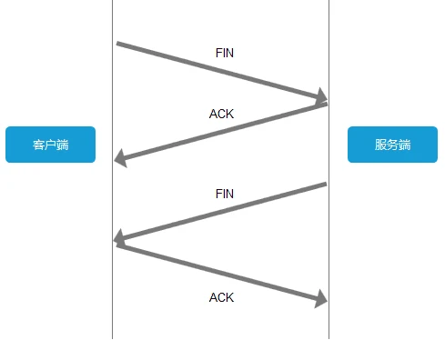

[toc]


# 1、在浏览器输入一个链接，做了哪些操作


## 1）DNS域名解析

浏览器客户端向**本地DNS服务器**发送一个含有域名www.cnblogs.com的DNS查询报文。本地DNS服务器把查询报文转发到根DNS服务器

- 根 DNS 服务器 ：返回顶级域 DNS 服务器的 IP 地址(com)
- 顶级域 DNS 服务器：返回权威 DNS 服务器的 IP 地址(www.cnblogs.com)
- 权威 DNS 服务器 ：返回相应主机的 IP 地址


### DNS用的是TCP协议还是UDP协议

DNS区域传输的时候使用TCP协议：

1.辅域名服务器会定时（一般3小时）向主域名服务器进行查询以便了解数据是否有变动。如有变动，会执行一次区域传送，进行数据同步。区域传送使用TCP而不是UDP，因为数据同步传送的数据量比一个请求应答的数据量要多得多。

2.TCP是一种可靠连接，保证了数据的准确性。

域名解析时使用UDP协议：

客户端向DNS服务器查询域名，一般返回的内容都不超过512字节，用UDP传输即可。不用经过三次握手，这样DNS服务器负载更低，响应更快。理论上说，客户端也可以指定向DNS服务器查询时用TCP，但事实上，很多DNS服务器进行配置的时候，仅支持UDP查询包。

## 2）建立TCP链接

即 三次握手


* 客户端发送一个带有**SYN标志**的数据包给服务端，
* 服务端收到后，回传一个带有**SYN/ACK标志**的数据包，表明确认信息
* 客户端再回传一个带ACK标志的数据包，代表握手结束，连接成功

注：

* ACK：此标志表示应答域有效，为1的时候表示应答域有效，反之为0，也规定**连接建立后**所有发送的报文的ACK必须为1
* SYN(SYNchronization)：在连接建立时用来同步序号。当SYN=1而ACK=0时，表明这是一个**连接请求**报文。
* FIN(finis)：终结的意思， 用来释放一个连接。当 FIN = 1 时，表明此报文段的发送方的数据已经发送完毕，并要求释放连接。

## 3）发送HTTP请求、服务器处理请求

TCP连接建立后，浏览器就可以利用HTTP/HTTPS协议，向服务器发送请求了

## 4）关闭TCP连接

为了避免服务器与客户端双方的资源占用和损耗，当双方没有请求或响应传递时，**任意一方**都可以发起关闭请求。与创建TCP连接的3次握手类似，关闭TCP连接，需要4次挥手。



* 第一次分手：主机1（可以是客户端，也可以是服务器，**因为TCP是可以双向传输数据的，也就是全双工协议**）向主机2发送一个FIN，这表示主机1没有数据要发送给主机2了
* 第二次分手：主机2收到了主机1发送的FIN报文段，**但它此时可能还有相应的数据报文需要发送，所以先向主机1回一个ACK报文段；告诉主机1，我"同意"你的关闭请求**，这样主机1就不会因为没有收到应答而继续发送断开连接的报文
* 第三次分手：主机2**处理完数据**后，向主机1发送FIN报文段，保证数据通信正常可靠的完成，主机二进入
* 第四次分手：主机1收到主机2发送的FIN报文段，向主机2发送ACK报文段，然后主机1进入**TIME_WAIT**状态；主机2收到主机1的ACK报文段以后，就关闭连接；此时，主机1等待2MSL后依然没有收到回复，则证明Server端已正常关闭，那好，主机1也可以关闭连接了。

### PS：为什么要四次挥手，而不是三次？

* 关闭连接时，主机1发送FIN时，仅仅表示**不再发送数据**了但是还能接受数据
* 主机2收到1的FIN报文时，先回一个ACK应答报文，而主机2可能还有数据需要处理，等他处理完，才发送FIN报文给主机1表示同意现在关闭连接

## 5）浏览器渲染

按照渲染的时间顺序，流水线可分为如下几个子阶段：构建 DOM 树、样式计算、布局阶段、分层、栅格化和显示

# 2、HTTP 协议

## HTTPS和HTTP的区别在哪里

* HTTP 明文传输，HTTPS（SSL+HTTP） 数据传输过程是加密的，安全性较好
* 使用 HTTPS 协议需要到 CA（Certificate Authority，数字证书认证机构） 申请证书
* HTTP 页面响应速度比 HTTPS 快，主要是因为 HTTP 使用 TCP 三次握手建立连接，客户端和服务器需要交换 3 个包，而 HTTPS除了 TCP 的三个包，还要加上 **ssl 握手**需要的 9 个包，所以一共是 12 个包
* http 和 https 使用的是完全不同的连接方式，用的端口也不一样，前者是 80，后者是 443
* HTTPS 其实就是建构在 SSL/TLS 之上的 HTTP 协议，所以，要比较 HTTPS 比 HTTP 要更耗费服务器资源。

## HTTPS 如何加密

近代加密算法是公开的，但密钥是保密的

* 共享密钥加密：必须把密钥也发给对方，但如果被窃听，密钥也丢了，就失去了加密的意义
* 公开密钥加密：发送密文的一方使用**对方的公开密钥**进行加密处理，对方收到之后再使用**自己的私有密钥进行解密**

HTTPS 采用混合加密方式，在**交换密钥环节使用公开加密方式**，之后的**建立通信交换报文阶段**则使用共享密钥加密方式：

* 使用公开密钥加密方式安全地交换在稍后的共享密钥加密中要使用的密钥
* 确保交换的密钥是安全的前提下，使用共享密钥加密方式进行通信

## HTTPS 交互过程

1）客户端发送报文开始ssl（Secure Socket Layer）通信，报文中包含了客户端支持的ssl指定版本、加密组件（所使用的**加密算法及密钥长度**等）列表
2）服务器可进行ssl通信时，会发送报文作为应答，报文中也会包含ssl版本以及加密组件
3）之后服务器发送Certificate报文，报文中包含公开密钥证书
4）最后服务器发送报文通知客户端，最初阶段的ssl握手协商部分结束
5）ssl第一次握手结束后，客户端以client key exchange 报文作为回应，报文中包含一个**随机密码串**，该报文已用步骤三的公开密钥进行加密
6）接着客户端继续发送 change cipher spec（更改密码规范） 报文，该报文会提示服务器，此后的通信使用上一步的随机密码串作为密钥加密
7）客户端发送Finished报文，该报文包含连接至今全部报文的整体校验值，这次握手协商能够成功，要以服务器是否能够正确解密该报文作为判定标准
8）服务器同样发送 change cipher spec报文
9）服务器同样发送Finished报文
10）服务器和客户端的Finished报文交换完毕之后，ssl连接就算建立完成，此后开始应用层协议的通信，即发送HTTP请求

## 浏览器如何验证HTTPS证书的合法性？

如何证明收到的公开密钥就是原本预想的那台服务器发行的公开密钥，或许在公开密钥传输途中，真正的公开密钥已经被攻击者替换掉了？
为了解决上述问题，可以使用数字认证机构颁发的公开密钥证书，机构会对申请者申请的公开密钥做数字签名，然后分配这个已签名的公开密钥，并将公开密钥放入证书后绑定

服务器会将这份证书发送给客户端，客户端可以使用公开密钥对证书上的数字签名进行验证，一旦验证通过，客户端就可以明确：服务器的公开密钥是有效值得信任的

认证机构的公开密钥必须转发给客户端，如果使用通信方式来转交，可能不安全，所以多数浏览器开发商发布版本时，会事先在内部植入认证机构的公开密钥

一个数字证书中通常包含：公钥、持有者信息、CA的信息、证书的有效期

证书的作用：认证公钥持有者的身份，以防第三方系统进行冒充


客户端校验服务端的数字证书的过程：

* 客户端使用同样的hash算法获取该证书的hash值H1
* 通常浏览器和操作系统集成了CA的公钥信息，浏览器收到证书后可以使用CA的公钥解密Certificate Signature 内容，得到一个 Hash 值 H2
* 最后比较H1和H2，如果值相同，则可信赖

## Get Post

本质上都是 `TCP`链接，并无差别

但是由于 `HTTP`的规定和浏览器/服务器的限制，导致他们在应用过程中会体现出一些区别

* GET请求反复读取不应该对访问的数据有副作用，被称为“幂等“
* GET请求会被浏览器主动cache，而POST不会，除非手动设置
* GET请求只能进行url编码，而POST支持多种编码方式
* GET请求在URL中传送的参数是有长度限制的，而POST没有
* GET参数通过URL传递，POST放在Request body中

## 建立 TCP 连接后，完成一次 HTTP 请求，TCP 是否会断开

HTTP协议Header中的Connection属性决定了连接是否持久，不同HTTP协议版本有所不同。

HTTP/1.0中Connection默认为close，即每次请求都会重新建立和断开TCP连接。缺点：建立和断开TCP连接，代价过大。

HTTP/1.1中Connection默认为keep-alive，即连接可以复用，不用每次都重新建立和断开TCP连接。超时之后没有连接则主动断开。可以通过声明Connection为close进行关闭。

优点：TCP连接可被重复利用，减少建立连接的损耗，SSL的开销也可以避免。刷新页面时也可以复用，从而不再建立SSL连接等。

结论：默认情况下（HTTP/1.1）建立TCP连接不会断开，只有在请求报头中声明Connection: close才会请求完成之后关闭连接。不断开的最终目的是减少建立连接所导致的性能损耗。

## 请求头

### Sec-Fetch-Site

可以确定请求是 “同站”，“同源” 还是 “跨站”

* cross-site
* same-site
* same-origin
* none

# 4、TCP 超时机制

我们都知道 TCP 协议具有重传机制，也就是说，如果发送方认为发生了丢包现象，就重发这些数据包。很显然，我们需要一个方法来「**猜测**」是否发生了丢包。最简单的想法就是，接收方每收到一个包，就向发送方返回一个 **ACK**，表示自己已经收到了这段数据，反过来，如果发送方一段时间内没有收到 ACK，就知道**很可能**是数据包丢失了，紧接着就重发该数据包，直到收到 ACK 为止。

你可能注意到我用的是「猜测」，因为即使是超时了，这个数据包也可能并没有丢，它只是绕了一条远路，来的很晚而已。毕竟 TCP 协议是位于**传输层**的协议，不可能明确知道数据链路层和物理层发生了什么。但这并不妨碍我们的超时重传机制，因为接收方会自动忽略重复的包。

超时和重传的概念其实就是这么简单，但内部的细节却是很多，我们最先想到的一个问题就是，**到底多长时间才能算超时呢**？

## 现场问题

数据库连接超时：原来防火墙有一个TCP超时时间，默认设置的为半小时，其意义是，对于通过防火墙的所有TCP连接，如果在半小时内没有任何活动，就会被防火墙拆除，这样就会导致连接中断。在拆除连接时，也不会向连接的两端发送任何数据来通知连接已经拆除。

这下数据库连接断开的原因找到了，那么这就是一个应用与数据库在不同的网络中，连接需要经过防火墙的场景中会遇到的一个典型问题，怎么能够使应用和数据库之间即使比较空闲也能够保持一定数量的长连接，是亟待解决的

## 方案一：连接池参数配置

Druid 数据库连接池提供一些参数，testWhileIdle设置为true后，间隔timeBetweenEvictionRunsMillis配置的时间，就执行一下validationQuery参数配置的sql，保持连接可用，防止超时中断
这种方式只适用于单个应用，数据库日志会记录大量无效sql

## 方案二：操作系统的tcp keepalive功能

centos系统提供keepalive功能，但默认是关闭的，需要jdbc连接增加参数tcpKeepAlive=true设置来启用
cp的keepalive，其实就是用来保持tcp连接的，其原理简单说就是如果一个TCP连接在指定的时间内没有任何活动，会发送一个探测包到连接的对端，检测连接的对端是否仍然存在，如果对端一定时间内仍没有对探测的响应，会再次发送探测包，发送几次后，仍然没有响应，就认为连接已经失效，关闭本地连接。
当设置了tcp keepalive之后，只要tcp探测包发送的时间小于防火墙的连接超时时间，防火墙就会检查到连接中仍然有数据传输，就不会断开这个连接
将linux系统参数net.ipv4.tcp_keepalive_time设置为600，在连接串中增加参数tcpKeepAlive=true，重启应用系统
这种方式需要同时修改每个应用的jdbcUrl

## 方案三：数据库参数

有的数据库提供了类似操作系统的tcpKeepAlive参数，可以通过日志判断应用连接是否有异常断开
这种方式可以作用于该数据库的所有连接，包括navicat、psql等连接，但只有部分数据库支持

# 5、TCP 和 UDP 的区别

TCP：面向连接的协议，提供可靠的数据传输

UDP：用户数据报协议，无连接的传输层协议，提供面向事务的简单不可靠传送服务

# 6、ping是基于什么协议

ping 命令是基于 ICMP 协议来工作的，**「 ICMP 」全称为 Internet 控制报文协议**（[Internet Control Message Protocol](https://link.zhihu.com/?target=https%3A//tools.ietf.org/html/rfc792)）。ping 命令会发送一份ICMP回显请求报文给目标主机，并等待目标主机返回ICMP回显应答。因为ICMP协议会要求目标主机在收到消息之后，必须返回ICMP应答消息给源主机，如果源主机在一定时间内收到了目标主机的应答，则表明两台主机之间网络是可达的。

1）假设有两个主机，主机A（192.168.0.1）和主机B（192.168.0.2），现在我们要监测主机A和主机B之间网络是否可达，那么我们在主机A上输入命令：ping 192.168.0.2；

2）此时，ping命令会在主机A上构建一个**ICMP的请求数据包**（数据包里的内容后面再详述），然后 ICMP协议会将这个数据包以及目标IP（192.168.0.2）等信息一同交给**IP协议**；

3）IP协议得到这些信息后，将源地址（即本机IP）、目标地址（即目标IP：192.168.0.2）、再加上一些其它的控制信息，构建成一个**IP数据包**；

4）IP数据包构建完成后，还不够，还需要加上**MAC地址**，因此，还需要通过**ARP映射表**找出目标IP所对应的MAC地址。当拿到了**目标主机的MAC地址和本机MAC后**，一并交给**数据链路层**，组装成一个数据帧，依据**以太网**的介质访问规则，将它们传送出出去；

5）当主机B收到这个数据帧之后，会首先检查它的目标MAC地址是不是本机，如果是就接收下来处理，接收之后会检查这个数据帧，将数据帧中的IP数据包取出来，交给本机的IP层协议，然后IP层协议检查完之后，再将ICMP数据包取出来交给ICMP协议处理，当这一步也处理完成之后，就会构建一个ICMP应答数据包，回发给主机A；

6）在一定的时间内，如果主机A收到了应答包，则说明它与主机B之间网络可达，如果没有收到，则说明网络不可达。除了监测是否可达以外，还可以利用应答时间和发起时间之间的差值，计算出数据包的延迟耗时。

# 7、流量控制

如果发送者发送数据过快，接收者来不及接收，那么就会有分组丢失。为了避免分组丢失，控制发送者的发送速度，使得接收者来得及接收，这就是流量控制。流量控制根本目的是防止分组丢失，它是构成TCP可靠性的一方面

由滑动窗口协议（连续ARQ协议）实现。滑动窗口协议既保证了分组无差错、有序接收，也实现了流量控制。主要的方式就是接收方返回的 ACK 中会包含自己的接收窗口的大小，并且利用大小来控制发送方的数据发送

# 8、如何阻止一个网络报文的分片

## 为什么会出现IP报文分片

为了传送一个大的IP报文，IP协议会根据链路接口的MTU对该IP报文进行分片，通过填充适当的IP头中的分片指示字段，接收计算机可以很容易地把这些IP分片报文组装起来
目标计算机在处理这些分片报文的时候，会把先到的分片报文缓存起来，然后一直等待后续的分片报文，这个过程会消耗一些内存。
如果攻击者给目标计算机只发送一片分片报文而不是所有的分片报文，这样目标计算机就会一直等待（直到一个内部计数器到时），如果攻击者发送了大量的分片报文，就会消耗计算机的资源。

## 防范

设备实时检测出分片报文并予以丢弃或者限速处理

# 10、TCP

## 头格式

* Sequence Number：包序号，用来解决网络包乱序的问题
* Acknowledgement Number：就是ack，用于确认收到，解决不丢包的问题
* Window：又叫 Advertised-Window，浮动窗口，用来解决流控
* TCP Flag：包类型，用于操控TCP状态机的

其实网络上的传输是没有连接的，包括TCP也一样，而TCP所谓的**连接**，只不过是在通讯双方维护一个**连接状态**，让他看上去有连接一样。


## 为什么要三次握手

主要是为了，通信双方要互相通知对方自己的初始化Sequence Number，全称 Synchronize Sequence Number（SYN），也就是上图的x和y，这个要作为以后数据通信的序号，保证应用层接收到的数据不会因为网络上的传输问题而乱序（TCP会用这个序号来拼接数据）

## 为什么要四次挥手？

因为TCP是全双工的，接收方和发送方都需要Fin和Ack。

## 重传机制

接收端给发送端的ack确认只会确认**最后一个连续的包**。比如，发送端发送了1，2，3，4，5——一共五份数据，接收端收到了1，2，于是回ack3（最后一个连续包+1），然后收到了4，没收到3。

如果不回ack，死等3，发送发发现收不到3的ack超时了，会重传3，一旦接收方收到3后，会回ack4。

但这样会导致，发送方认为4，5也丢了。

所以可以只重传timeout的包，也就是第三份数据。

## TCP 滑动窗口

TCP 要解决可靠传输以及包乱序的问题，所以，必须知道网络实际的数据处理带宽或是数据处理速度，这样才不会引起网络拥堵，导致丢包。

因此，TCP 引入了**Sliding Window**来做网络流控。

**TCP 头里面有一个字段叫Window，这个字段是接收端告诉发送端自己还有多少缓冲区可以接收数据。于是发送端就可以根据这个接收端的处理能力来发送数据，而不会导致接收端处理不过来。**


根据TCP缓冲区中读到的位置、收到最后一个连续包的位置，接收端在给发送端回ack中汇报自己的AdvertisedWindow

# 11、ARP 协议

ARP 协议的全称是 Address Resolution Protocol(地址解析协议)，它是一个通过用于实现从 IP 地址到 MAC 地址的映射，即询问目标 IP 对应的 MAC 地址 的一种协议。

# 12、Socket


HTTP，WebSocket，TCP，UDP，IP都是协议，而 TCP/IP 是不同协议的组合，通常称之为 协议栈，是为了完成对应功能而制定的统一规则。

Socket（套接字）实际上是对**TCP/IP协议栈**的封装，本身并不是协议，而是一个调用接口（API），可以理解为抽象层，比如 create、listen、connect、accept、send、read和write

# 13、IP

## 环回地址

每个主机都可能有多个 ip 地址，比如多个网卡或多 ip，127.0.0.1 是本地环回地址，专供自己访问自己，速度快(不用经过整个协议栈)，永远都不能出现在主机外部的网络中，所以只适合用在开发环境。

localhost 只是 127.0.0.1 的别名

## 0.0.0.0

表示主机上所有的IPv4地址，如果一个主机有两个IP地址，192.168.1.1 和 10.1.2.1，并且该主机上的一个服务监听的地址是0.0.0.0,那么通过两个ip地址都能够访问该服务。


## 为什么放行了某端口，但是telnet不通

即使服务在监听指定的端口，服务可能只绑定到了  **特定的接口** ，而不是  **所有接口** 。通常，这种问题在服务配置中会体现为绑定到 `127.0.0.1`（仅本地回环接口）而不是 `0.0.0.0`（所有接口）或者服务器的实际 IP 地址。


# iptables

## 什么是 iptables

实现包过滤、端口转发、NAT 等功能。

通过规则链来控制网络数据包，并且可以根据不同的规则链来进行不同的操作。

iptables 主要由表（table）、链（chain）、规则（rule）组成。

## 命令详解

### 表(table)

表，是最顶层的结构，用于存放规则链。共有四张表：filter、nat、mangle、raw

* filter表：用于过滤数据包 RAR FOR LINUX，是 iptables 命令中最常用的表。
* nat表：用于网络地址转换(NAT)，主要用于路由器等设备上。
* mangle表：用于修改数据包的TTL值、TOS值等。
* raw表：用于指定不被连接跟踪的数据包。

### 链(chain)

是一级结构，每个链都有一个默认的策略（policy），当数据包没有匹配任务**规则**时，就会按照改策略处理。

共有5个预定义链：

* INPUT链：处理进入本地主机的数据包
* OUTPUT链：处理从本地主机发出的数据包
* FORWARD链：处理转发到其他主机的数据包
* PREROUTING链：在路由前对数据包进行处理
* POSTROUTING链：在路由后对数据包进行处理

### 规则(rule)

规则是基本操作单元，可以根据不同条件匹配网络数据包，并执行不同动作。规则，由**匹配条件**和**动作**两部分组成。

匹配条件可以是以下类型：

* 网络协议
* 源IP地址
* 目标IP地址
* 源端口号
* 目标端口号

动作可以是以下类型：

* ACCEPT：允许数据包通过
* DROP：丢弃数据包
* REJECT：拒绝数据包
* SNAT：源地址转换
* DNAT：目标地址转换

### 常用参数


## 示例

```bash
iptables [-t表名]命令[链名][规则号][参数]

iptables -t filter -s x.x.x.x -I INPUT -j ACCEPT
```
