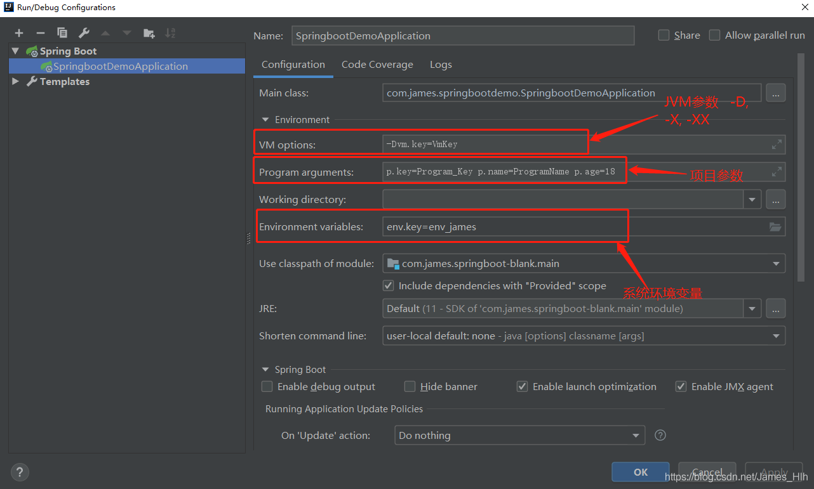

[TOC]


# 编码篇

## 一、数值问题

### 1、精度
Java的浮点类型默认是double，如果希望把一个浮点类型当作float处理，应该在这个值后面加f或者F
float代表单精度浮点数，占4字节，32位
double代表单精度浮点数，占8字节，64位
```java
// 精度丢失 0
int i1 = 1;
int i2 = 2;
System.out.println(i1 / i2);

// 精度不丢失 0.5
float f1 = 1;
float f2 = 2;
System.out.println(f1 / f2);

// 精度不丢失 0.5
double d1 = 1;
double d2 = 2;
System.out.println(d1 / d2);

// 输出 0.12345679
float f1 = 0.123456789123456789f;
System.out.println(f1);
// 输出 0.12345678912345678
double d1 = 0.123456789123456789d;
System.out.println(d1);

System.out.println("0.05 + 0.01 =" + (0.05 + 0.01));
System.out.println("1.0 - 0.42 =" + (1.0 - 0.42));
System.out.println("4.015 * 100 =" + (4.015 * 100));
System.out.println("123.3 / 100 =" + (123.3 / 100));

// 0.05 + 0.01 = 0.060000000000000005
// 1.0 - 0.42 = 0.5800000000000001
// 4.015 * 100 = 401.49999999999994
// 123.3 / 100 = 1.2329999999999999
```

## 二、百分数
```java
// 先计算分母，BigDecimal构造器入参得是String，不能使用double，除非 BigDecimal.valueOf (double val)
BigDecimal denominator = new BigDecimal(String.valueOf(vo.getBsfs() + vo.getSqjz()));
if (denominator.compareTo(new BigDecimal("0.0")) != 0) {
    // 0 代表一个数字，# 代表不包括0的数字，所以不用 # 做占位符
    DecimalFormat decimalFormat = new DecimalFormat("00.00%");
    // 保留两位，4舍5入
    vo.setBsl(decimalFormat.format(new BigDecimal(String.valueOf(vo.getBss())).divide(denominator, 2, BigDecimal.ROUND_HALF_UP)));
}
```


# 工具篇
## IDEA
### 一、shorten command line
如果类路径太长，或者有许多VM参数，程序就无法启动。原因是大多数操作系统都有命令行长度限制。在这种情况下，IntelliJIDEA将试图缩短类路径。

shorten command line 选项提供三种选项缩短类路径。

* none：这是默认选项，idea不会缩短命令行。如果命令行超出了OS限制，这个想法将无法运行您的应用程序，但是工具提示将建议配置缩短器。

* JAR manifest：idea 通过临时的classpath.jar传递长的类路径。原始类路径在MANIFEST.MF中定义为classpath.jar中的类路径属性。

* classpath file：idea 将一个长类路径写入文本文件中。

#### 问题
某项目把单值代码相关的表存放在 db_aty 模式下，但控制台打印出的sql没有拼接模式名
疑点一：这是不应该走缓存吗，为什么会去查库

疑点二：为什么之前是可以的，本地重启了项目就不行了


### 二、VM options/Program arguments/Environment variables


|参数|使用方式|示例|代码获取方式|
|-|-|-|-|
|VM Options|必须以-D 、 -X 、 -XX 开头，每个参数用空格隔开|-Dvm.key=VmKey -Dvm.key2=VmKey2|String key = System.getProperty(“vm.key”);|
|Program Arguments|每个参数用空格隔开|p.key=Program_Key p.name=ProgramName p.age=18|main(String[] args)|
|Environment Variable|其优先级低于 VM options ，即如果VM options 有一个变量和 Environment variable中的变量的key相同，则以VM options 中为准， 以分号分割多个|env.key=env_james;server.servlet.context-path=/test;server.port=8080|String envKey = System.getenv(“env.key”);|
