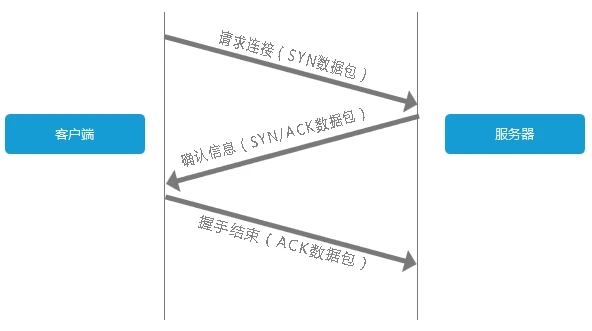

[TOC]


# 一、Java基础
## int 是多少字节
4字节，占32位
取值范围：-2^31 ~ 2^31 - 1
32个格子里放满0或1，有2^32中可能（约43亿）


## 为什么要重写 hashcode() 方法
主要原因是默认从Object继承来的hashCode是基于**对象的ID**实现的。
如果你重写了equals，比如说是基于**对象的内容**实现的，而保留hashCode的实现不变，那么很可能某两个对象明明是“相等”，而hashCode却不一样。
这样，当你用其中的一个作为键保存到hashMap、hashTable或hashSet中，再以“相等的”找另一个作为键值去查找他们的时候，则根本找不到。
new 了两个对象，内存地址肯定不一样，但我们比较对象是想比较这俩对象的内容 

* 对于值对象，== 比较的是两个对象的值
* 对于引用对象，比较的是两个对象的地址
默认的equals方法同==，一般来说我们的对象都是引用对象，要重写equals方法。
**所以如果我们对equals方法进行了重写，建议一定要对hashCode方法重写，以保证相同的对象返回相同的hash值，不同的对象返回不同的hash值。**


## Java 是引用传递还是值传递
JAVA都是值传递的
```java
int num = 10;
String str = "hello";
```
num是基本类型，值就直接保存在变量中。而str是引用类型，变量中保存的只是实际对象的地址。一般称这种变量为"引用"，引用指向实际对象，实际对象中保存着内容。

其实就是操作的是一块内存还是新开辟了一块内存的区别,结果搞一堆术语来反而没人理解,局限于术语上去了


## 什么是面向对象
面向对象是一种编程思想，Java语言实现了这种思想。
之所以要面向对象，是为了应对需求的变化。

说到面向对象，一般都会提到面向过程：
举一个刚学Java的时候经常听到的例子，为了把大象装进冰箱，需要三个过程
1）把冰箱门打开
2）把大象装进去
3）把冰箱门关上
对于面向对象：
为了把大象装进冰箱，需要做三个动作，每个动作有一个执行者，他就是对象
1）冰箱，给我把门打开
2）冰箱，给我把大象装进去
3）冰箱，给我把门关上

如果这个时候要求再装一只熊猫，再装一只其他动物，面向过程就要扩展整个过程，而面向对象，由于我已经封装了装东西这个方法，无论是装什么，只是入参不同。


**纵向增加代码复杂度**，换取**对代码进行增删改查时最小工作量**

面向对象有三大特点：封装、继承、多态，就是为了强化代码应对变化时的适应能力，
面向过程把视角放在不稳定的操作之上，把描述客体的属性和行为分开了，应用程序日后的维护和扩展相当困难，甚至一个微小的变动，都会涉及整个系统。

## 注解

1、@Retention（保留策略）：编译、类加载、运行时
2、@Target：指定该注解能用于修饰哪些程序单元
3、提取注解信息：通过反射API读取：getAnnotation(Class)
4、重复注解：通过注解**容器**，可以在一个元素前使用多个相同类型的注解


## 创建一个对象的过程

### 创建对象的方法

1、new 关键字：调用任意构造函数

2、Class类的newInstance（反射）

3、Constructor类的newInstance（反射）

4、clone方法

5、反序列化

### 对象创建过程


1、类加载检查：

遇到new指令之后，首先到**静态常量池**中看看能不能找到这个指令对应的**符号引用**

然后检查**符号引用**对应的类是否被**加载-连接-初始化**，如果有的话，就进行第二步，如果没有就先进行类的加载

2、分配内存

类加载检查通过后，对象的**大小**在类加载完成之后就可以确定，所以首先为新创建的对象根据对象大小**分配内存**，这块内存在**堆**中划分，那么如何进行内存的分配呢？

有两种情况，**“指针碰撞”和“空闲列表”**，根据**Java堆是否规整**决定

3、初始化零值

从类加载过程中，我们了解到：在准备过程中会将final修饰的静态变量直接赋初值，对static修饰的静态变量赋零值

对应普通成员变量，我们不清楚是何时初始化的，那么这个阶段就是给成员变量进行初始化

**虚拟机需要把分配到的内存空间中的数据类型都初始化为零值（不包括对象头）**，这一步操作保证了对象的实例字段在Java代码中可以不赋初始值直接使用，程序能访问这些字段的数据类型所对应的零值

4、设置对象头

初始化零值完成之后，虚拟机要对对象进行必要的设置，例如这个对象是那个类的实例，如果能找到类的元数据信息，对象的哈希码，对象的GC分代年龄等信息。

这些信息存放在对象头中

5、指向init方法

在上面工作都完成之后，从虚拟机的视角来看，一个新的对象已经产生了，但从 Java 程序的视角来看，对象创建才刚开始，方法还没有执行，所有的字段都还为零。所以一般来说，执行 new 指令之后会接着执行方法，把对象按照程序员的意愿进行初始化，这样一个真正可用的对象才算完全产生出来。


## 反射

### 如何通过反射改变对象的内容
得到 Class 对象，通过getMethods()或者getMethod()方法获取**Method对象**，然后通过该对象来调用它对应的方法。Method 包含一个 invoke() 方法
```java
    /**
     * @param obj  执行该方法的对象
     * @param args 执行该方法时传入的实参
    */
    @CallerSensitive
    public Object invoke(Object obj, Object... args)
        throws IllegalAccessException, IllegalArgumentException,
           InvocationTargetException
    {
        if (!override) {
            if (!Reflection.quickCheckMemberAccess(clazz, modifiers)) {
                Class<?> caller = Reflection.getCallerClass();
                checkAccess(caller, clazz, obj, modifiers);
            }
        }
        MethodAccessor ma = methodAccessor;             // read volatile
        if (ma == null) {
            ma = acquireMethodAccessor();
        }
        return ma.invoke(obj, args);
    }
```


### 可以改变枚举对象内容吗？
可以，但这个枚举类必须提供了Set方法，一般来说，枚举类通常设计成不可变类，也就是说他的成员变量值不允许改变，建议枚举类的成员变量都使用 private final 修饰，那么就要在构造器里为这些成员变量指定初始值
一旦定义了带参数的构造器，罗列 **枚举值（在第一行列出，逗号分隔，分号结尾）** 时就必须对应的传入参数


### 原理

```java
    // 1. 使用外部配置的实现，进行动态加载类
    TempFunctionTest test = (TempFunctionTest)Class.forName("com.tester.HelloReflect").newInstance();
    test.sayHello("call directly");
    // 2. 根据配置的函数名，进行方法调用（不需要通用的接口抽象）
    Object t2 = new TempFunctionTest();
    Method method = t2.getClass().getDeclaredMethod("sayHello", String.class);
    method.invoke(test, "method invoke");
```

执行流程如下：


#### 反射获取类实例
首先调用Class的静态方法，获取类信息：
```java
    @CallerSensitive
    public static Class<?> forName(String className)
                throws ClassNotFoundException {
        // 先通过反射，获取调用此方法的类信息，从而获取当前的 classLoader
        Class<?> caller = Reflection.getCallerClass();
        // 调用native方法进行获取class信息
        return forName0(className, true, ClassLoader.getClassLoader(caller), caller);
    }
```

forName() 反射获取类信息，并没有将实现留给java，而是交给jvm去加载。
主要是先获取 ClassLoader，然后调用 native 方法，获取信息，加载类回调 java.lang.ClassLoader，最后，jvm 又会回调 ClassLoader 进行类加载。
最后，jvm又会回调ClassLoader进行类加载。


怎么在运行时，获取到这些类的信息

1、获取到反射类及反射方法

2、每个类都有一个与之对应的Class实例，从而每个类都可以获取method反射方法，作用于其他实例

3、反射使用软引用relectionData缓存class信息，避免每次重新从jvm获取带来的开销

4、反射调用多次生成的新代理Accessor

5、当找到需要的方法时，都会copy一份出来，而不是使用原来的实例，从而保证了数据隔离

6、调度反射方法，最终由jvm执行 invoke0();


## lambda 原理

1、以`@FunctionalInterface`修饰的接口，**有且只有一个抽象方法（public abstract在接口中可以默认省略）**，可以有多个静态和默认方法

2、


## IO

### 为什么要有IO

程序要和外部进行数据交互

### 文件系统

以最常见的输入输出设备为例：硬盘，也可以理解为文件系统。

Java程序是运行在JVM上的，对于Java程序来说硬盘并不可见，可见的是操作系统提供的文件系统，要用Java操作文件系统，首先要表示文件，即**FIle类**。

### 抽象基类

IO流的概念不仅仅局限在操作文件上，是要能操作**所有输入输出**，所以有两个顶层抽象类表示操作所有输入输出：InputStream、OutputStream

这两个类表示字节的输入输出，而字节是最基本的流，因为计算机底层传递的就是字节

### 访问文件

按照面向对象的思想，既然要操作文件，那就有了FileInputStream、FileOutputStream作为子类

### 缓冲流

原始的字节流不高效，每个字节都调用底层的操作系统API

而缓冲区的流对象，可以一次读一个缓冲区，缓冲区空了才去调用一次底层API，可以大大提高效率，所以有了BufferedInputStream和BufferedOutputSteam，他们的用法是把字节流对象传入后再使用，也相当于把它俩套在了字节流的外面，给字节流装了个“外挂”

### 转换流

InputStreamReader和OutputStreamWriter。把字节流转成字符流，就不用操作字节流了，可以用人类的方式read和write各种“文字”

### 字符输入输出流

最常见的是和文件系统打交道，读取文本文件能不能用一种方便的方式呢？

FileReader和FileWriter这两个流对象可以直接把文件转成读取、写入流。让你省去了创建字节流，再套上转换流的步骤

### 字符缓冲流

再把Reader和writer做成高效的，就需要BufferedReader和BufferedWriter，把他们套在Reader和Writer上，就能实现高效的字符流。

### java io一般有哪些操作 一般会出现什么样的问题

#### 字符编码

不管是什么文字，计算机中都是按照**一定规则**将其以二进制保存的，这个规则就是字符集，在进行文件读写的时候，如果是在**字节**层面进行操作，不会涉及字符编码问题；
但如果是在**字符**层面进行读写，需要明确字符集。
写入和读取时，使用的不是同一个字符集，会出问题。

比如 FileReader 是以当前机器的默认字符集来读取文件的，如果这个文件写入是GBK，读取是UTF-8，就会乱码
如果需要指定字符集，需要直接使用 InputStreamReader 和 FileInputStream

#### 文件句柄
程序打开过多文件会导致`Too many open files`，所以要关流

可以使用`ulimit -a`查看系统可用资源：open files，默认1024

排查问题，可以先用 lsof -p pid 查看该进程打开了哪些文件，然后 lsof -p pid | grep 文件名 | wc -l

数据库安装时，一般会修改这个配置，因为数据库会占用大量的文件

一般数据库服务器要求和应用服务器分开，应用服务请求**数据库连接池**中的一个连接，然后数据库自己的操作是IO操作

#### 不关闭流
使用 FileInputStream 读取一个文件但没有显式关闭输入流，会导致一些潜在的问题
1. 资源泄露：文件句柄资源被耗尽
2. 文件锁定：某些操作系统，打开一个文件会产生文件锁，阻止其它进程操作该文件
3. 内存泄漏：相关对象一直在内存里

使用网络流发起一个请求（比如使用 URLConnection 或者 HttpClient）但没有关闭这个流
1. 资源泄露：网络资源一直被占用，比如本地端口
2. 连接池耗尽
3. 占用内存


#### 设置缓冲区
使用 FileInputStream 获得一个文件输入流，然后调用其 read 方法每次读取一个字节，最后通过一个 FileOutputStream 文件输出流把处理后的结果写入另一个文件。
每读取一个字节、每写入一个字节都进行一次 IO 操作，代价太大了，而且这样将文件转为字节全部读入，有OOM的风险。

解决方案就是，考虑使用**一块内存区域作为直接操作的中转**，也就是缓冲区，一次性从原文件读取一定数量的数据到缓冲区，一次性写入一定数量的数据到目标文件
在进行文件 IO 处理的时候，使用合适的缓冲区可以明显提高性能

BufferedInputStream 和 BufferedOutputStream在内部实现了一个默认 8KB 大小的缓冲区。但是，在使用 BufferedInputStream 和 BufferedOutputStream 时，我还是建议你再使用一个缓冲进行读写，不要因为它们实现了内部缓冲就进行逐字节的操作


#### 缓存导致数据丢失


图中WEB服务器通过输出流向客户端响应了一个300字节的信息，但是，这时的输出流有一个1024字节的缓冲区。所以，输出流就一直等着WEB服务器继续向客户端响应信 息，当WEB服务器的响应信息把输出流中的缓冲区填满时，这时，输出流才向WEB客户端响应消息。

为了解决这种尴尬的局面，flush()方法出现了。flush()方法可以强迫输出流(或缓冲的流)发送数据，即使此时缓冲区还没有填满，以此来打破这种死锁的状态。

当我们使用输出流发送数据时，当数据不能填满输出流的缓冲区时，这时，数据就会被存储在输出流的缓冲区中。如果，我们这个时候调用关闭(close)输出流，存储在输出流的缓冲区中的数据就会丢失。所以说，关闭(close)输出流时，应先刷新(flush)换冲的输出流，话句话说就是：“迫使所有缓冲的输出数据被写出到底层输出流中”。


## String、StringBuilder、StringBuffer
### 为什么 String 不可变
String 类被声明为 final，因此不可被继承，
内部使用char数组存储数据，该数组被申明为final，意味着value数组初始化之后，就不能再引用其它数组。并且String内部没有改变value数组的方法，保证了String不可变

```java
public final class String
    implements java.io.Serializable, Comparable<String>, CharSequence {
    /** The value is used for character storage. */
    private final char value[];
```
### 可变性
* String 不可变
* StringBuffer 和 StringBuilder 可变


### 线程安全
* String 不可变，因此是线程安全的
* StringBuilder 不是线程安全的
* StringBuffer 是线程安全的，内部使用 synchronized 进行同步


### 泛型
为什么要用泛型：
> 通过泛型指定的不同类型，来控制形参具体限制的类型

\<?> 无限制通配符
\<? extends E> 声明了类型的上界，表示参数化的类型可能是所指定的类型，或者是此类型的**子类**
\<? super E> 声明了类型的下界，表示参数化类型可能是指定的类型，或者是此类型的**父类**

* 如果参数化类型表示一个 T 的生产者，使用 \<? extends T>，只能取（get），不能放（set）
* 如果表示一个 T 的消费者，使用 \<? super T>
* 如果既是生产者又是消费者，使用通配符就没意义了，需要精确的参数类型

# 二、容器

> 容器主要包括 Collection 和 Map 两种，Collection 存储着对象的集合，而 Map 存储着键值对(两个对象)的映射表。


## Collection
定义了一些通用的方法：增加/删除元素，是否包含某个元素 之类。
Collection 继承了 Iterable 接口，它定义了hasNext() 和 next()方法，让每个具体的实现类定义自己的迭代方式，因为每个集合内部的数据结构可能都不相同

### List 接口 
有序集合，集合中的元素可以重复，根据索引访问集合中的元素


#### ArrayList

##### 底层数据结构

```java
    transient Object[] elementData; // non-private to simplify nested class access
    private int size;
```

基于**动态数组**，对于随机访问get和set，拥有绝对优势，因为LinkedList要移动指针

##### 扩容机制

如果通过无参构造，初始容量为0，开始添加第一个元素时，才真正分配容量，默认分配容量是10
当容量不足时（容量为size，添加第size+1个元素时），先判断按照1.5倍（位运算）的比例扩容能否满足最低容量要求，如果满足则以1.5倍扩容，否则以最低容量的要求扩容

扩容时，会将老数组中的元素重新拷贝一份到新的数组中，这种代价是比较高的，所以在实际使用中，如果知道要保存多少元素，构建实例时，就手动指定容量。

#### LinkedList

*LinkedList*同时实现了*List*接口和*Deque*接口，也就是说它既可以看作一个顺序容器，又可以看作一个队列(*Queue*)，同时又可以看作一个栈(*Stack*)

##### 底层数据结构

```java
private static class Node<E> {
    E item;
    Node<E> next;
    Node<E> prev;

    Node(Node<E> prev, E element, Node<E> next) {
        this.item = element;
        this.next = next;
        this.prev = prev;
    }
}
```

基于**双向链表**，链表的每个节点用内部类Node表示。

对于新增/删除，LinkedList比较占优，因为ArrayList要移动数据

这一点要看实际情况的。若只对**顺序**插入或删除，ArrayList的速度反而优于LinkedList。但若是**批量随机**的插入删除数据，LinkedList的速度大大优于ArrayList. 因为ArrayList每插入一条数据，要移动插入点及之后的所有数据。


### Queue

#### Deque

`Deque`是"double ended queue", 表示双向的队列，英文读作"deck". Deque 继承自 Queue接口

关于栈或队列，现在的首选是*ArrayDeque*，它有着比*LinkedList*(当作栈或队列使用时)有着更好的性能


### Set接口

无序集合，元素不可重复，根据**元素本身**来访问集合中的元素

由于不包含重复元素，任意两个元素e1、e2都有e1.equals(e2)=false，Set最多有一个null元素

虽然Set中元素没有顺序（不会按照存入的顺序排序），但是元素在Set中的位置是由该元素的HashCode决定的，其位置是固定的。

也就是说，如果某个类重写了hashcode和equals方法，那么这两个对象如果内容相同，add第二个对象会返回false

#### HashSet

由HashMap实现，不保证插入的顺序和输出的顺序一致，允许使用Null

通过一个HashMap存储元素，**元素存放在Key中**，Value统一使用一个Object对象

#### LinkedHashSet

底层基于LinkedHashMap，同样也是根据元素的hashCode值来决定元素的存储位置，但它同时使用**链表**维护元素的次序，所以是有序的

#### TreeSet

基于TreeMap，支持**自然排序和定制排序**

它不是通过hashcode和equals方法来比较元素的，而是通过`Comparator`来判断元素是否相等，如果相等，不会被加入到集合中。


## Map

保存的是Key-value形式的数据，Key不能相同，value可以相同

### LinkedHashMap

是HashMap的子类，**二者唯一的区别是LinkedHashMap在HashMap的基础上，采用双向链表(doubly-linked list)的形式将所有`entry`连接起来，这样是为保证元素的迭代顺序跟插入顺序相同**


### TreeMap

有序的key-value集合，基于**红黑树**实现，每一个key-value节点作为红黑树的一个节点

**存储时**会进行排序，**根据key**来对key-value键值对进行排序。

#### 自然排序
Key 的类，要实现`Comparable`接口，重写 compareTo() 方法。

Compareable 是排序接口，如果一个类实现了Compareable接口，意味着**该类支持排序**，相当于**内部比较器**。

```java
@AllArgsConstructor
@ToString
@EqualsAndHashCode
class R implements Comparable<R> {

    int count;

    @Override
    public int compareTo(R r) {
        return Integer.compare(count, r.count);
    }
}

@Test
public void testComparable() {
    TreeMap<R, String> tm = new TreeMap<>();
    tm.put(new R(3), "java");
    tm.put(new R(9), "php");
    tm.put(new R(-5), "python");
    tm.put(new R(-4), "js");
    // 会报错
//        tm.put(null, "js");
    log.info("{}", tm);
    log.info("{}", tm.firstEntry());
    log.info("{}", tm.lastKey());
}
```


#### 定制排序
Comparator 是比较器接口，如果我们要控制某个类的次序，而该类本身不支持排序（即没有实现Comparable接口）；
那么，我们可以建立一个**该类的比较器**来进行排序，相当于**外部比较器**
需要注意的是，这个时候，TreeMap的构造器要传入我们实现的Comparator实现类。

```java
@AllArgsConstructor
@ToString
@EqualsAndHashCode
class R1 implements Comparator<R1> {

    int count;

    @Override
    public int compare(R1 o1, R1 o2) {
        return Integer.compare(o1.count, o2.count);
    }
}

@Test
public void testComparator() {
    TreeMap<R1, String> tm = new TreeMap<>(new R1(0));
    tm.put(new R1(3), "java");
    tm.put(new R1(9), "php");
    tm.put(new R1(-5), "python");
    tm.put(new R1(-4), "js");
    log.info("{}", tm);
}
```


### HashMap

#### 数组结构

* 优点：由于数组是连续的，读取/修改效率高
* 缺点：插入/删除效率低，因为插入数据，这个位置后面的数据都要往后移动，且大小固定，不易扩展

```java
transient Node<K,V>[] table;
```

#### 链表结构

* 优点：插入/删除速度快，没有固定大小，扩展灵活
* 缺点：不能随机查找，每次都是从第一个开始遍历

#### 哈希表结构

结合了两者的优点，HashMap就是这样的一种结构


Java8 中使用Node和TreeNode 来分别表示链表和红黑树

```java
static final class TreeNode<K,V> extends LinkedHashMap.Entry<K,V> {}

static class Node<K,V> implements Map.Entry<K,V> {}
```


#### 1、put(k,v) 实现原理

1）首先把key、value 封装到Node对象（节点）中
2）调用key的hashCode()方法得到hash值
3）通过哈希算法，把hash值转换成数组的下标，这个下标位置如果没有任何元素，就把Node添加到这个位置。
如果下标对应的位置上有链表，这时就拿着k和链表上每个节点的k进行equals，
如果所有equals方法返回的都是false，那么这个新的节点将被添加到链表末尾，如果有一个equals返回了true，那么这个节点将会被覆盖

#### 2、get(k) 实现原理

1）先调用k的hashCode()方法得到哈希值，通过哈希算法转换成数组的下标
2）通过下标快速定位到某个位置，如果这个位置上啥都没有，返回null
如果这个位置上有单向链表，那就拿着k和单向链表上的每个节点的k进行equals，如果所有equals方法都返回false，返回null
如果其中一个节点的k和参数k进行equals返回true，那么返回这个value


#### 3、为什么效率高

增删是在链表上完成的，而查询只需扫描部分，则效率高
HashMap集合的key，会先后调用两个方法，hashCode and equals方法，这这两个方法都需要重写。

##### 红黑树

当hash表的单一链表长度超过 8 个的时候，链表结构就会转为红黑树结构


* 红黑树查询：其访问性能近似于折半查找，时间复杂度 O(logn)；
* 链表查询：这种情况下，需要遍历全部元素才行，时间复杂度 O(n)；

简单的说，红黑树是一种近似平衡的二叉查找树，其主要的优点就是“平衡“，即左右子树高度几乎一致，以此来防止树退化为链表，通过这种方式来保障查找的时间复杂度为 log(n)。

#### HashMap 扩容

resize() 用于初始化数组或数组扩容，每次扩容后，新数组的容量为原来的**两倍**，遍历原数组进行数据迁移


#### 与Hashtable的区别：

1）HashMap允许将null作为一个entry的key或者null，而Hashtable不允许

2）HashMap继承自AbstractMap，而Hashtable继承自Dictionary，他们都实现了Map接口

3）Hashtable中大量的方法是synchronized修饰的，而HashMap不是

4）HashMap计算hash，对key的hashcode进行二次hash，但Hashtable是直接使用key的hashcode

#### 与TreeMap的区别
```java
public class HashMap<K,V> extends AbstractMap<K,V>
    implements Map<K,V>, Cloneable, Serializable

public class TreeMap<K,V>
    extends AbstractMap<K,V>
    implements NavigableMap<K,V>, Cloneable, java.io.Serializable
```
1）从类定义上来看：HashMap和TreeMap都继承自AbstractMap，不同的是HashMap实现的是Map接口，而TreeMap实现的是NavigableMap接口。NavigableMap是SortedMap的一种，实现了对Map中key的排序

2）从排序上看：所以TreeMap是有序的，而HashMap无序（插入/取出的顺序）

3）从Null上看：HashMap可以有一个null值的key和多个null值的value，但TreeMap不允许有null key，但可以有 null value


### Iterator 与 ListIterator

Iterator提供了三个api：

- boolean hasNext()：只能单向向后遍历，判断集合里是否存在下一个元素。如果有，hasNext()方法返回 true。
- Object next()：返回集合里下一个元素。
- void remove()：删除集合里上一次next方法返回的元素。
  - 这是唯一安全的方式来在迭代中增加/修改集合元素，并且每调用一次next方法，remove方法只能被调用一次，否则将会抛出异常

ListIterator只能用于各种List类型的访问，可以双向遍历

# 三、Spring

## 1、整体介绍下Spring

## 2、Bean 的注册过程
1）初始化Beanfactory
2）注册一个bean，其实就是一个key-value结构，key是名字，value是bean定义的信息
3）bean里面有class信息，属性信息
4）然后通过beanfactory获取bean，第一次获取不到，会往单例对象的缓存中singletonObjects存数据
5）第二次获取，会从singletonObjects中拿


## 3、Bean 的定义都包括什么信息
1）对象信息
2）属性信息
3）初始化方法
4）销毁时方法
5）单例、原型


## 4、Spring 事务
### 生效原理
当一个方法被@Transactional注解之后，Spring 会基于AOP**在方法执行之前开启一个事务**。当方法执行完毕之后，**根据方法是否报错，来决定回滚或提交事务**，Spring 在处理事务时，会从连接池中获得一个jdbc connection，将连接绑定到线程上（基于 ThreadLocal），那么同一个线程中用到的就是同一个 connection 了。

1）Spring 通过动态代理的方式实现AOP，对目标方法进行增强，private方法无法代理到
2）如果是同一个类中一个无事务方法调用另一个方法有事务的方法，事务是不会起作用的，因为这个时候调用方是this，通过this访问方法不会走代理，要调用增强过的方法，必然是调用代理后的对象，**必须通过代理过的类从外部调用目标方法才会生效**
3）只有目标方法**抛出**了**运行时异常或error**，事务才能回滚，TransactionAspectSupport  里面有个 invokeWithinTransaction 方法，处理事务逻辑：只有捕获到异常才进行后续事务处理
4）不要使用多线程，@Transactional在处理事务时会（基于ThreadLocal）将连接绑定到当前线程，由于@Transactional绑定管理的是主线程的事务，而parallelStream开启的新的线程与主线程无关。因此，事务也就无效了


### 隔离级别
事务隔离级别指的是一个事务对数据的修改与另一个并行的事务的隔离程度，当多个事务同时访问相同数据时，如果没有采取必要的隔离机制，就可能发生以下问题：

* 脏读：一个事务读到另一个事务未提交的更新数据，所谓脏读，就是指事务A读到了事务B还没有提交的数据，比如银行取钱，事务A开启事务，此时切换到事务B，事务B开启事务–>取走100元，此时切换回事务A，事务A读取的肯定是数据库里面的原始数据，因为事务B取走了100块钱，并没有提交，数据库里面的账务余额肯定还是原始余额，这就是脏读
* 幻读：是指当事务不是独立执行时发生的一种现象，例如第一个事务对一个表中的数据进行了修改，这种修改涉及到表中的全部数据行。 同时，第二个事务也修改这个表中的数据，这种修改是向表中插入一行新数据。那么，以后就会发生操作第一个事务的用户发现表中还有没有修改的数据行，就好象 发生了幻觉一样。
* 不可重复读：在一个事务里面的操作中发现了未被操作的数据 比方说在同一个事务中先后执行两条一模一样的select语句，期间在此次事务中没有执行过任何DDL语句，但先后得到的结果不一致，这就是不可重复读

Spring建议的是使用DEFAULT，就是数据库本身的隔离级别：
```java
@Transactional(isolation=Isolation.DEFAULT)
public void fun(){
	dao.add();
	dao.udpate();
}
```
### 生效机制
1）必须在public方法上：
spring默认通过动态代理的方法实现aop，对目标方法进行增强，private方法无法代理到
2）必须通过代理过的类从外部调用目标方法才生效
3）Spring 默认只会对标记 @Transactional 注解的方法出现了 RuntimeException 和 Error 的时候回滚，如果我们的方法捕获了异常，那么需要通过手动编码处理事务回滚

## 5、AOP

**面向切面编程 - Aspect Oriented Programming**

### 1）为什么要有aop
软件开发中，散布于应用多处的功能被称为横切关注点，这些横切关注点从概念上是和业务逻辑分离的（但是往往会直接嵌入到业务逻辑中），把这些横切关注点与业务逻辑分离正是面向切面编程要解决的问题。

### 2）aop如何实现
如何使用代理，给一个接口的实现类，用代理的方式替换掉这个实现类，使用代理类处理我需要的逻辑。

#### 方法拦截
Spring默认在目标类实现接口时是通过JDK代理实现的，只有非接口的是通过Cglib代理实现的

JDK:

```java
Proxy.newProxyInstance(target.getClass().getClassLoader(), target.getClass().getInterfaces(), new InvocationHandler() {}
```
CGLIB:
* 基于 Cglib 使用 Enhancer 代理的类可以在运行期间为接口使用底层 ASM 字节码增强技术处理对象的代理对象生成，因此被代理类不需要实现任何接口
* 扩展进去的用户拦截方法，主要是在 Enhancer#setCallback 中处理
* 被代理的对象不可以用final修饰，否则会报异常：java.lang.IllegalArgumentException


### 3）术语
#### 1）通知（Advice）
切面要完成的工作：
前置通知
后置通知
返回通知
异常通知
环绕通知

#### 2）连接点（Join point）
插入切面的时机，可以是调用方法时，抛出异常时
切面利用这些点插入到应用的正常流程中


#### 3）切点（Point）
匹配类和方法名称

#### 4）切面
通知+切点=切面

## 6、Bean 加载过程

## 7、Bean生命周期


利用spring提供的扩展点来自定义bean创建过程
* 实例化
* 填充属性
* 调用 BeanNameAware 的 setBeanName() 方法
* 调用 BeanFactoryAware 的 setBeanFactory() 方法
* 调用 ApplicationContextAware 的 setApplicationContext() 方法
* 调用 BeanPostProcessor 的预初始化方法
* 调用 InitializationBean 的afterPropertiesSet() 方法
* 调用自定义的初始化方法
* 调用 BeanPostProcessor 的初始化方法
* bean可以使用
容器关闭：
* 调用 Dispo

@Component、@Configuration分别注解在类上

@Bean注解在方法上，有什么差异，是不是都是单例的

Spring配置文件类型

### BeanFactory() ApplicationContext()区别
1、都可以获取bean，但获取bean存在区别
* BeanFactory 在初始化容器时，并没有实例化Bean，直到第一次访问某个Bean时才会实例化它
* ApplicationContext 会在初始化应用上下文时就实例化所有单实例的Bean

2、对BeanPostProcessor中的方法调用方式不同
如果使用BeanFactory，必须显示调用

## 8、IOC


 **Inversion of Control (IoC)**

如果不使用控制反转，多个组件用到了同一个service，就要创建多个对象，那就是我们只做到了逻辑复用，并没有做到资源复用。
许多组件只需要实例化一个对象就行，创建多个没意义

出现这个问题的原因是：组件的调用方参与了组件的创建和配置工作。
解决方案就是如果有一个东西帮我们创建和配置好那些组件，我们只负责调用。这个东西就是容器，称之为**ioc容器**。

控制反转，指对象的创建和配置的控制权，从调用方转移给容器，交由容器管理的对象称之为bean。


## 9、装配Bean
1、xml 显式配置
2、Java 显式配置
3、隐式的 bean 发现机制和自动装配
### 自动化装配 bean
什么是装配：创建**应用之间的协作关系**的行为
1、组件扫描（component scan）：spring 会自动发现应用上下文中创建的bean
	设置@ComponentScan基础包
2、自动装配（autowiring）：spring自动满足bean之间的依赖
	@Autowired

## 10、bean 的作用域
* 单例：在整个应用中，只创建bean的一个实例
* 原型：每次注入或者通过spring应用上下文获取的时候，都会创建一个新的bean实例
* 会话：在web应用中，为每个会话创建一个bean实例
* 请求：在web应用中，为每个请求创建一个bean实例


## 11、springmvc的请求
1）所有请求会通过DispatcherServlet（前端控制器）
2）DispatcherServlet 查询 handler mapping，确定请求的下一站，根据请求携带的url信息来决策
3）DispatcherServlet 把请求发送给选中的控制器（controller），卸下请求中所带的所有信息
4）将模型数据和视图名发送给 DispatcherServlet
5）DispatcherServlet 使用视图解析器来将逻辑视图名匹配成一个特定的视图实现
6）最后一站是视图的实现，在视图交付模型数据
7）通过响应对象传递给客户端

## 12、属性依赖

### 单例循环依赖

Spring只是解决了单例模式下属性依赖的循环问题，使用了三级缓存。

```java
/** Cache of singleton objects: bean name --> bean instance */
private final Map<String, Object> singletonObjects = new ConcurrentHashMap<String, Object>(256);
 
/** Cache of early singleton objects: bean name --> bean instance */
private final Map<String, Object> earlySingletonObjects = new HashMap<String, Object>(16);

/** Cache of singleton factories: bean name --> ObjectFactory */
private final Map<String, ObjectFactory<?>> singletonFactories = new HashMap<String, ObjectFactory<?>>(16);
```

* 第一层缓存（singletonObjects）：单例对象缓存池，已经实例化并且属性赋值，这里的对象是**成熟对象**
* 第二层缓存（earlySingletonObjects）：单例对象缓存池，已经实例化但尚未属性赋值，这里的对象是**半成品对象**；
* 第三层缓存（singletonFactories）：单例工厂的缓存

关键的就是第三层：对象已经生产了，但还没初始化完成，但能够被人认出来（根据对象引用能定位到堆中的对象），**因此 Spring 提前将这个对象曝光出来，让别人使用**。

举例：A对象setter依赖B对象，B对象setter依赖A对象

A 首先完成了初始化第一步，而且将本身提早曝光到singletonFactories中，这时进行初始化第二步，发现本身依赖B，尝试去get(B)，发现B尚未被create，因此走create流程

B在初始化第一步时，发现本身依赖对象A，因此尝试get(A)，尝试了一级缓存发现没有（因为A还没初始化彻底），尝试二级缓存也没有，尝试三级缓存，因为A经过 ObjectFactory 将本身提前曝光了，因此 B 可以经过 ObjectFactories.getObject 拿到 A 对象（半成品）。

B 拿到 A 对象后顺利完成了初始化，彻底初始化后将本身放入到一级缓存中。返回A中，A此时能拿到B的对象顺利完成本身的初始化，放入到一级缓存中。


### 其它循环依赖

#### Spring 不能解决构造器的循环依赖

调用构造方法之前，还没将它放入三级缓存，后续依赖调用构造方法的时候，并不能从三级缓存中获取到依赖的Bean。

#### 使用 @DependsOn，指定加载先后关系。


## 13、缓存
@Cacheable：表明Spring调用该方法之前，首先在缓存中查找方法的返回值，如果这个值能够找到，就会返回缓存的值，否则，这个方法就会被调用，返回值会被放到缓存中。

@CachePut：表明Spring 应该将返回值放到缓存中，在方法调用前并不会检查缓存，方法始终会被调用。

@CacheEvit：表明Spring应该在缓存中清除一个或多个条目

@Caching：这是一个分组注解：能够同时应用多个其他缓存注解。


# 四、安全

## 防重放攻击

重复攻击：截取到了请求参数，原封不动的再发送N次，一般请求通过验证后会进入到正常的逻辑，可能会重复插入数据，频繁操作数据库也会导致性能下降

### timestamp + nonce

服务端拿到时间戳和当前时间做对比，比如60秒内有效，超过60秒就不会进后端逻辑，那么就把重放攻击的时间缩短到了60秒。

但这样还是不够，客户端按照一定规则生成随机数，比如md5，可以在短时间内（比如60秒）几乎不可能生成两个相同的随机数

### 服务端

服务端拿到这个随机数时做下面操作

1）解密后，去redis中查找是否有key为nonce:{随机数}的string

2）如果没有，就创建这个key，这个key的失效时间和timestamp失效时间一致

3）如果有，说明这个key在60秒内已经被使用了，那么这个请求可以被判定为重放请求。

## CSRF 跨站请求伪造


## XSS 跨站脚本攻击

往Web页面里插入恶意Script代码，当用户浏览该页之时，嵌入其中Web里面的Script代码会被执行

# 五、Spring Boot

## 1、自动配置原理

1）bean的自动配置

`@EnableAutoConfiguration`：开启**自动配置**功能

```java
@Target(ElementType.TYPE)
@Retention(RetentionPolicy.RUNTIME)
@Documented
@Inherited
@AutoConfigurationPackage
@Import(AutoConfigurationImportSelector.class)
public @interface EnableAutoConfiguration {}
```

AutoConfigurationImportSelector的selectImports()方法通过SpringFactoriesLoader.loadFactoryNames()扫描所有具有META-INF/spring.factories的jar包下面key是EnableAutoConfiguration全名的，所有自动配置类

2）属性的自动配置

@ConfigurationProperties注解上的属性，将配置文件中对应key的值绑定到属性上


## 2、内嵌容器是什么？和war包部署的区别？

### jar包与war包的区别

jar：

* 通过内置的tomcat运行，不需要额外安装
* 通过改Spring Boot的配置文件，可以修改内置的tomcat的配置；
* 内置的tomcat没有自己的日志输出，全靠jar包应用输出日志

war：

* 传统的交付方式，需要安装tomcat，然后放到**webapps**目录下运行
* 可以灵活选择tomcat版本，可以直接修改tomcat的配置
* 有自己的日志输出

### SpringBoot的jar和普通jar的区别

与传统的jar包不同之处在于有一个名为lib的目录，这个目录中包含了应用所依赖的其他jar包和内嵌的tomcat

除了业务源码所编译形成的class外，在org目录下还有许多Spring提供的class，正是依赖这些class加载位于lib目录下jar中的类。

### 部署方式

jar包：java -jar

war包：放在webapps目录下，启动tomcat，即tomcat源码中的启动类

```java
package org.apache.catalina.startup;
public final class Bootstrap {
    /**
     * Main method and entry point when starting Tomcat via the provided
     * scripts.
     *
     * @param args Command line arguments to be processed
     */
    public static void main(String args[]) {}
}
```


# 六、网络


## 1、在浏览器输入一个链接，做了哪些操作


### 1）DNS域名解析

浏览器客户端向**本地DNS服务器**发送一个含有域名www.cnblogs.com的DNS查询报文。本地DNS服务器把查询报文转发到根DNS服务器

- 根 DNS 服务器 ：返回顶级域 DNS 服务器的 IP 地址(com)
- 顶级域 DNS 服务器：返回权威 DNS 服务器的 IP 地址(www.cnblogs.com)
- 权威 DNS 服务器 ：返回相应主机的 IP 地址


#### DNS用的是TCP协议还是UDP协议

DNS区域传输的时候使用TCP协议：

1.辅域名服务器会定时（一般3小时）向主域名服务器进行查询以便了解数据是否有变动。如有变动，会执行一次区域传送，进行数据同步。区域传送使用TCP而不是UDP，因为数据同步传送的数据量比一个请求应答的数据量要多得多。

2.TCP是一种可靠连接，保证了数据的准确性。

域名解析时使用UDP协议：

客户端向DNS服务器查询域名，一般返回的内容都不超过512字节，用UDP传输即可。不用经过三次握手，这样DNS服务器负载更低，响应更快。理论上说，客户端也可以指定向DNS服务器查询时用TCP，但事实上，很多DNS服务器进行配置的时候，仅支持UDP查询包。


### 2）建立TCP链接

即 三次握手



* 客户端发送一个带有**SYN标志**的数据包给服务端，
* 服务端收到后，回传一个带有**SYN/ACK标志**的数据包，表明确认信息
* 客户端再回传一个带ACK标志的数据包，代表握手结束，连接成功

注：

* ACK：此标志表示应答域有效，为1的时候表示应答域有效，反之为0，也规定**连接建立后**所有发送的报文的ACK必须为1
* SYN(SYNchronization)：在连接建立时用来同步序号。当SYN=1而ACK=0时，表明这是一个**连接请求**报文。
* FIN(finis)：终结的意思， 用来释放一个连接。当 FIN = 1 时，表明此报文段的发送方的数据已经发送完毕，并要求释放连接。


### 3）发送HTTP请求、服务器处理请求

TCP连接建立后，浏览器就可以利用HTTP/HTTPS协议，向服务器发送请求了

### 4）关闭TCP连接

为了避免服务器与客户端双方的资源占用和损耗，当双方没有请求或响应传递时，**任意一方**都可以发起关闭请求。与创建TCP连接的3次握手类似，关闭TCP连接，需要4次挥手。


* 第一次分手：主机1（可以是客户端，也可以是服务器，**因为TCP是可以双向传输数据的，也就是全双工协议**）向主机2发送一个FIN，这表示主机1没有数据要发送给主机2了

* 第二次分手：主机2收到了主机1发送的FIN报文段，**但它此时可能还有相应的数据报文需要发送，所以先向主机1回一个ACK报文段；告诉主机1，我"同意"你的关闭请求**，这样主机1就不会因为没有收到应答而继续发送断开连接的报文

* 第三次分手：主机2**处理完数据**后，向主机1发送FIN报文段，保证数据通信正常可靠的完成，主机二进入

* 第四次分手：主机1收到主机2发送的FIN报文段，向主机2发送ACK报文段，然后主机1进入**TIME_WAIT**状态；主机2收到主机1的ACK报文段以后，就关闭连接；此时，主机1等待2MSL后依然没有收到回复，则证明Server端已正常关闭，那好，主机1也可以关闭连接了。


#### PS：为什么要四次挥手，而不是三次？

* 关闭连接时，主机1发送FIN时，仅仅表示**不再发送数据**了但是还能接受数据
* 主机2收到1的FIN报文时，先回一个ACK应答报文，而主机2可能还有数据需要处理，等他处理完，才发送FIN报文给主机1表示同意现在关闭连接

### 5）浏览器渲染

按照渲染的时间顺序，流水线可分为如下几个子阶段：构建 DOM 树、样式计算、布局阶段、分层、栅格化和显示

## 2、HTTP 和 HTTPS

### HTTPS和HTTP的区别在哪里

* HTTP 明文传输，HTTPS（SSL+HTTP） 数据传输过程是加密的，安全性较好
* 使用 HTTPS 协议需要到 CA（Certificate Authority，数字证书认证机构） 申请证书
* HTTP 页面响应速度比 HTTPS 快，主要是因为 HTTP 使用 TCP 三次握手建立连接，客户端和服务器需要交换 3 个包，而 HTTPS除了 TCP 的三个包，还要加上 **ssl 握手**需要的 9 个包，所以一共是 12 个包
* http 和 https 使用的是完全不同的连接方式，用的端口也不一样，前者是 80，后者是 443
* HTTPS 其实就是建构在 SSL/TLS 之上的 HTTP 协议，所以，要比较 HTTPS 比 HTTP 要更耗费服务器资源。

#### HTTPS 如何加密
近代加密算法是公开的，但密钥是保密的
* 共享密钥加密：必须把密钥也发给对方，但如果被窃听，密钥也丢了，就失去了加密的意义
* 公开密钥加密：发送密文的一方使用**对方的公开密钥**进行加密处理，对方收到之后再使用**自己的私有密钥进行解密**

HTTPS 采用混合加密方式，在**交换密钥环节使用公开加密方式**，之后的**建立通信交换报文阶段**则使用共享密钥加密方式：
* 使用公开密钥加密方式安全地交换在稍后的共享密钥加密中要使用的密钥
* 确保交换的密钥是安全的前提下，使用共享密钥加密方式进行通信

#### HTTPS 交互过程
1）客户端发送报文开始ssl（Secure Socket Layer）通信，报文中包含了客户端支持的ssl指定版本、加密组件（所使用的**加密算法及密钥长度**等）列表
2）服务器可进行ssl通信时，会发送报文作为应答，报文中也会包含ssl版本以及加密组件
3）之后服务器发送Certificate报文，报文中包含公开密钥证书
4）最后服务器发送报文通知客户端，最初阶段的ssl握手协商部分结束
5）ssl第一次握手结束后，客户端以client key exchange 报文作为回应，报文中包含一个**随机密码串**，该报文已用步骤三的公开密钥进行加密
6）接着客户端继续发送 change cipher spec（更改密码规范） 报文，该报文会提示服务器，此后的通信使用上一步的随机密码串作为密钥加密
7）客户端发送Finished报文，该报文包含连接至今全部报文的整体校验值，这次握手协商能够成功，要以服务器是否能够正确解密该报文作为判定标准
8）服务器同样发送 change cipher spec报文
9）服务器同样发送Finished报文
10）服务器和客户端的Finished报文交换完毕之后，ssl连接就算建立完成，此后开始应用层协议的通信，即发送HTTP请求


#### 浏览器如何验证HTTPS证书的合法性？
如何证明收到的公开密钥就是原本预想的那台服务器发行的公开密钥，或许在公开密钥传输途中，真正的公开密钥已经被攻击者替换掉了？
为了解决上述问题，可以使用数字认证机构颁发的公开密钥证书，机构会对申请者申请的公开密钥做数字签名，然后分配这个已签名的公开密钥，并将公开密钥放入证书后绑定

服务器会将这份证书发送给客户端，客户端可以使用公开密钥对证书上的数字签名进行验证，一旦验证通过，客户端就可以明确：服务器的公开密钥是有效值得信任的

认证机构的公开密钥必须转发给客户端，如果使用通信方式来转交，可能不安全，所以多数浏览器开发商发布版本时，会事先在内部植入认证机构的公开密钥


一个数字证书中通常包含：公钥、持有者信息、CA的信息、证书的有效期

证书的作用：认证公钥持有者的身份，以防第三方系统进行冒充


客户端校验服务端的数字证书的过程：

* 客户端使用同样的hash算法获取该证书的hash值H1
* 通常浏览器和操作系统集成了CA的公钥信息，浏览器收到证书后可以使用CA的公钥解密Certificate Signature 内容，得到一个 Hash 值 H2
* 最后比较H1和H2，如果值相同，则可信赖


### Get Post

本质上都是`TCP`链接，并无差别

但是由于`HTTP`的规定和浏览器/服务器的限制，导致他们在应用过程中会体现出一些区别

* GET请求反复读取不应该对访问的数据有副作用，被称为“幂等“
* GET请求会被浏览器主动cache，而POST不会，除非手动设置
* GET请求只能进行url编码，而POST支持多种编码方式
* GET请求在URL中传送的参数是有长度限制的，而POST没有
* GET参数通过URL传递，POST放在Request body中


### 建立 TCP 连接后，完成一次 HTTP 请求，TCP 是否会断开
HTTP协议Header中的Connection属性决定了连接是否持久，不同HTTP协议版本有所不同。

HTTP/1.0中Connection默认为close，即每次请求都会重新建立和断开TCP连接。缺点：建立和断开TCP连接，代价过大。

HTTP/1.1中Connection默认为keep-alive，即连接可以复用，不用每次都重新建立和断开TCP连接。超时之后没有连接则主动断开。可以通过声明Connection为close进行关闭。

优点：TCP连接可被重复利用，减少建立连接的损耗，SSL的开销也可以避免。刷新页面时也可以复用，从而不再建立SSL连接等。

结论：默认情况下（HTTP/1.1）建立TCP连接不会断开，只有在请求报头中声明Connection: close才会请求完成之后关闭连接。不断开的最终目的是减少建立连接所导致的性能损耗。


## 4、TCP 超时机制

我们都知道 TCP 协议具有重传机制，也就是说，如果发送方认为发生了丢包现象，就重发这些数据包。很显然，我们需要一个方法来「**猜测**」是否发生了丢包。最简单的想法就是，接收方每收到一个包，就向发送方返回一个 **ACK**，表示自己已经收到了这段数据，反过来，如果发送方一段时间内没有收到 ACK，就知道**很可能**是数据包丢失了，紧接着就重发该数据包，直到收到 ACK 为止。

你可能注意到我用的是「猜测」，因为即使是超时了，这个数据包也可能并没有丢，它只是绕了一条远路，来的很晚而已。毕竟 TCP 协议是位于**传输层**的协议，不可能明确知道数据链路层和物理层发生了什么。但这并不妨碍我们的超时重传机制，因为接收方会自动忽略重复的包。

超时和重传的概念其实就是这么简单，但内部的细节却是很多，我们最先想到的一个问题就是，**到底多长时间才能算超时呢**？

### 现场问题

数据库连接超时：原来防火墙有一个TCP超时时间，默认设置的为半小时，其意义是，对于通过防火墙的所有TCP连接，如果在半小时内没有任何活动，就会被防火墙拆除，这样就会导致连接中断。在拆除连接时，也不会向连接的两端发送任何数据来通知连接已经拆除。

这下数据库连接断开的原因找到了，那么这就是一个应用与数据库在不同的网络中，连接需要经过防火墙的场景中会遇到的一个典型问题，怎么能够使应用和数据库之间即使比较空闲也能够保持一定数量的长连接，是亟待解决的

### 方案一：连接池参数配置
Druid 数据库连接池提供一些参数，testWhileIdle设置为true后，间隔timeBetweenEvictionRunsMillis配置的时间，就执行一下validationQuery参数配置的sql，保持连接可用，防止超时中断
这种方式只适用于当个应用，数据库日志会记录大量无效sql
### 方案二：操作系统的tcp keepalive功能
centos系统提供keepalive功能，但默认是关闭的，需要jdbc连接增加参数tcpKeepAlive=true设置来启用
cp的keepalive，其实就是用来保持tcp连接的，其原理简单说就是如果一个TCP连接在指定的时间内没有任何活动，会发送一个探测包到连接的对端，检测连接的对端是否仍然存在，如果对端一定时间内仍没有对探测的响应，会再次发送探测包，发送几次后，仍然没有响应，就认为连接已经失效，关闭本地连接。
当设置了tcp keepalive之后，只要tcp探测包发送的时间小于防火墙的连接超时时间，防火墙就会检查到连接中仍然有数据传输，就不会断开这个连接
将linux系统参数net.ipv4.tcp_keepalive_time设置为600，在连接串中增加参数tcpKeepAlive=true，重启应用系统
这种方式需要同时修改每个应用的jdbcUrl
### 方案三：数据库参数
有的数据库提供了类似操作系统的tcpKeepAlive参数，可以通过日志判断应用连接是否有异常断开
这种方式可以作用于该数据库的所有连接，包括navicat、psql等连接，但只有部分数据库支持


## 5、TCP 和 UDP 的区别

TCP：面向连接的协议，提供可靠的数据传输

UDP：用户数据报协议，无连接的传输层协议，提供面向事务的简单不可靠传送服务


## 6、ping是基于什么协议

ping 命令是基于 ICMP 协议来工作的，**「 ICMP 」全称为 Internet 控制报文协议**（[Internet Control Message Protocol](https://link.zhihu.com/?target=https%3A//tools.ietf.org/html/rfc792)）。ping 命令会发送一份ICMP回显请求报文给目标主机，并等待目标主机返回ICMP回显应答。因为ICMP协议会要求目标主机在收到消息之后，必须返回ICMP应答消息给源主机，如果源主机在一定时间内收到了目标主机的应答，则表明两台主机之间网络是可达的。

1）假设有两个主机，主机A（192.168.0.1）和主机B（192.168.0.2），现在我们要监测主机A和主机B之间网络是否可达，那么我们在主机A上输入命令：ping 192.168.0.2；

2）此时，ping命令会在主机A上构建一个**ICMP的请求数据包**（数据包里的内容后面再详述），然后 ICMP协议会将这个数据包以及目标IP（192.168.0.2）等信息一同交给**IP协议**；

3）IP协议得到这些信息后，将源地址（即本机IP）、目标地址（即目标IP：192.168.0.2）、再加上一些其它的控制信息，构建成一个**IP数据包**；

4）IP数据包构建完成后，还不够，还需要加上**MAC地址**，因此，还需要通过**ARP映射表**找出目标IP所对应的MAC地址。当拿到了**目标主机的MAC地址和本机MAC后**，一并交给**数据链路层**，组装成一个数据帧，依据**以太网**的介质访问规则，将它们传送出出去；

5）当主机B收到这个数据帧之后，会首先检查它的目标MAC地址是不是本机，如果是就接收下来处理，接收之后会检查这个数据帧，将数据帧中的IP数据包取出来，交给本机的IP层协议，然后IP层协议检查完之后，再将ICMP数据包取出来交给ICMP协议处理，当这一步也处理完成之后，就会构建一个ICMP应答数据包，回发给主机A；

6）在一定的时间内，如果主机A收到了应答包，则说明它与主机B之间网络可达，如果没有收到，则说明网络不可达。除了监测是否可达以外，还可以利用应答时间和发起时间之间的差值，计算出数据包的延迟耗时。


## 7、流量控制

如果发送者发送数据过快，接收者来不及接收，那么就会有分组丢失。为了避免分组丢失，控制发送者的发送速度，使得接收者来得及接收，这就是流量控制。流量控制根本目的是防止分组丢失，它是构成TCP可靠性的一方面

由滑动窗口协议（连续ARQ协议）实现。滑动窗口协议既保证了分组无差错、有序接收，也实现了流量控制。主要的方式就是接收方返回的 ACK 中会包含自己的接收窗口的大小，并且利用大小来控制发送方的数据发送


## 8、如何阻止一个网络报文的分片

### 为什么会出现IP报文分片
为了传送一个大的IP报文，IP协议会根据链路接口的MTU对该IP报文进行分片，通过填充适当的IP头中的分片指示字段，接收计算机可以很容易地把这些IP分片报文组装起来
目标计算机在处理这些分片报文的时候，会把先到的分片报文缓存起来，然后一直等待后续的分片报文，这个过程会消耗一些内存。
如果攻击者给目标计算机只发送一片分片报文而不是所有的分片报文，这样目标计算机就会一直等待（直到一个内部计数器到时），如果攻击者发送了大量的分片报文，就会消耗计算机的资源。
### 防范
设备实时检测出分片报文并予以丢弃或者限速处理


## 10、TCP 

### 头格式

* Sequence Number：包序号，用来解决网络包乱序的问题
* Acknowledgement Number：就是ack，用于确认收到，解决不丢包的问题
* Window：又叫 Advertised-Window，浮动窗口，用来解决流控
* TCP Flag：包类型，用于操控TCP状态机的

其实网络上的传输是没有连接的，包括TCP也一样，而TCP所谓的**连接**，只不过是在通讯双方维护一个**连接状态**，让他看上去有连接一样。


### 为什么要三次握手

主要是为了，通信双方要互相通知对方自己的初始化Sequence Number，全称 Synchronize Sequence Number（SYN），也就是上图的x和y，这个要作为以后数据通信的序号，保证应用层接收到的数据不会因为网络上的传输问题而乱序（TCP会用这个序号来拼接数据）

### 为什么要四次挥手？

因为TCP是全双工的，接收方和发送方都需要Fin和Ack。


### 重传机制

接收端给发送端的ack确认只会确认**最后一个连续的包**。比如，发送端发送了1，2，3，4，5——一共五份数据，接收端收到了1，2，于是回ack3（最后一个连续包+1），然后收到了4，没收到3。

如果不回ack，死等3，发送发发现收不到3的ack超时了，会重传3，一旦接收方收到3后，会回ack4。

但这样会导致，发送方认为4，5也丢了。

所以可以只重传timeout的包，也就是第三份数据。


### TCP 滑动窗口

TCP 要解决可靠传输以及包乱序的问题，所以，必须知道网络实际的数据处理带宽或是数据处理速度，这样才不会引起网络拥堵，导致丢包。

因此，TCP 引入了**Sliding Window**来做网络流控。

**TCP 头里面有一个字段叫Window，这个字段是接收端告诉发送端自己还有多少缓冲区可以接收数据。于是发送端就可以根据这个接收端的处理能力来发送数据，而不会导致接收端处理不过来。**


根据TCP缓冲区中读到的位置、收到最后一个连续包的位置，接收端在给发送端回ack中汇报自己的AdvertisedWindow


## 11、ARP 协议
ARP 协议的全称是 Address Resolution Protocol(地址解析协议)，它是一个通过用于实现从 IP 地址到 MAC 地址的映射，即询问目标 IP 对应的 MAC 地址 的一种协议。


# 七、Redis

## 1、数据结构场景


### String 字符串

#### 命令
```shell
// 添加键值对
set <key> <value>
// 查询对应键值
get <key>
// 将给定的value追加到原值的末尾
append <key> <value>
// 获得值的长度
strlen <key>
// 只有在key不存在时，设置key的值
setnx <key> <value>
// 将key中储存的数字值增减1.只能对数字值操作，如果为空，新增值为1/-1
incr/decr <key>
// 将key中储存的数字值增减，自定义步长
incrby/decrby <key> <步长>
// 同时设置一个或多个key-value对
mset <key1> <value1> <key2> <value2>...
// 同时获取一个或多个value
mget <key1><key2><key3>
// 同时设置一个或多个key-value对，当且仅当所有给定key都不存在，有一个失败，则都失败
msetnx <key1> <value1> <key2> <value2>...

// 获得值的范围，类似Java中的substring，前包，后包
getrange <key><起始位置><结束位置>

// 用<value>覆写<key>所存储的字符串值，从<起始位置>开始（索引从0开始）
setrange <key> <起始位置> <value>

// 设置键值的同时，设置过期时间，单位秒
setex <key><过期时间><value>

// 以新换旧，设置了新值同时获得旧值
getset <key> <value>

// 查看剩余有效时间
ttl <key>
```
#### 场景
* 缓存：redis作为缓存层，数据库做持久化层，降低数据库的读写压力
* session：实现session共享

### List 列表

#### 命令
```shell
127.0.0.1:6379> lpush mylist 1 2 ll ls mem
(integer) 5
127.0.0.1:6379> lrange mylist 0 -1
1) "mem"
2) "ls"
3) "ll"
4) "2"
5) "1"
127.0.0.1:6379> lindex mylist -1
"1"
127.0.0.1:6379> lindex mylist 10        # index不在 mylist 的区间范围内
(nil)
```
#### 场景
* 微博：有人发布微博，用lpush加入时间轴，展示最新的列表信息
* 消息队列：利用List的 PUSH 操作，将任务存放在List中，然后工作线程再用 POP 操作将任务取出进行执行

### Set 集合
> Redis 的 Set 是 String 类型的无序集合。集合成员是唯一的，这就意味着集合中不能出现重复的数据。
> Redis 中集合是通过哈希表实现的，所以添加，删除，查找的复杂度都是 O(1)。


#### 命令
```shell
127.0.0.1:6379> sadd myset hao hao1 xiaohao hao
(integer) 3
127.0.0.1:6379> smembers myset
1) "xiaohao"
2) "hao1"
3) "hao"
127.0.0.1:6379> sismember myset hao
(integer) 1
```

#### 场景
* 标签：给用户加标签


### Hash 散列
> Redis hash 是一个 string 类型的 field（字段） 和 value（值） 的映射表，hash 特别适合用于存储对象。


#### 命令
```shell
127.0.0.1:6379> hset user name1 hao
(integer) 1
127.0.0.1:6379> hset user email1 hao@163.com
(integer) 1
127.0.0.1:6379> hgetall user
1) "name1"
2) "hao"
3) "email1"
4) "hao@163.com"
127.0.0.1:6379> hget user user
(nil)
127.0.0.1:6379> hget user name1
"hao"
127.0.0.1:6379> hset user name2 xiaohao
(integer) 1
127.0.0.1:6379> hset user email2 xiaohao@163.com
(integer) 1
127.0.0.1:6379> hgetall user
1) "name1"
2) "hao"
3) "email1"
4) "hao@163.com"
5) "name2"
6) "xiaohao"
7) "email2"
8) "xiaohao@163.com"
```

#### 场景
* 缓存：更直观的维护缓存信息，比如用户信息


### Zset 有序集合
> Redis 有序集合和集合一样也是 string 类型元素的集合,且不允许重复的成员。不同的是每个元素都会关联一个 double 类型的分数。redis 正是通过分数来为集合中的成员进行从小到大的排序。
> 有序集合的成员是唯一的,但分数(score)却可以重复。集合是通过哈希表实现的，所以添加，删除，查找的复杂度都是 O(1)


#### 命令
```shell
127.0.0.1:6379> zadd myscoreset 100 hao 90 xiaohao
(integer) 2
127.0.0.1:6379> ZRANGE myscoreset 0 -1
1) "xiaohao"
2) "hao"
127.0.0.1:6379> ZSCORE myscoreset hao
"100"
```

#### 场景
* 排行榜：对up主的关注数做排行

## 2、分布式锁

学习分布式锁之前，应该先了解线程锁，进程锁。

### 线程锁

用来给方法、代码块加锁。同一时刻仅有一个线程执行该方法或者该代码段。线程锁只在同一个JVM中有效果，**因为线程锁的实现在根本上是依靠线程之间共享内存实现的**，比如synchronized是共享对象头，显示锁Lock是共享某个变量（state）

### 进程锁

为了控制**同一操作系统**中多个进程访问某个共享资源，因为进程具有**独立性**，各个进程无法访问其他进程的资源，因此无法通过synchronized等线程锁实现进程锁。

### 分布式锁

多个进程不在同一个系统中，用分布式锁控制多个进程对资源的访问

### 基于数据库实现分布式锁

#### 悲观锁

使用了`select…for update`的方式，这样就通过开启排他锁的方式实现了悲观锁。此时在t_goods表中，id为1的 那条数据就被我们锁定了，其它的事务必须等本次事务提交之后才能执行。这样我们可以保证当前的数据不会被其它事务修改

#### 乐观锁

使用版本号时，可以在数据初始化时指定一个版本号，每次对数据的更新操作都对版本号执行+1操作。并判断当前版本号是不是该数据的最新的版本号

### 基于 Redis 实现

set NX PX + Lua

**加锁**： set NX PX + 重试 + 重试间隔

向Redis发起如下命令: `SET productId:lock 0xx9p03001 NX PX 30000`

其中，"productId"由自己定义，可以是与本次业务有关的id，"0xx9p03001"是一串随机值，必须保证全局唯一。

“NX"指的是当且仅当key(也就是案例中的"productId:lock”)在Redis中不存在时，返回执行成功，否则执行失败。

"PX 30000"指的是在30秒后，key将被自动删除。执行命令后返回成功，表明服务成功的获得了锁


## 3、持久化
### 为什么需要持久化
Redis 基于内存，服务一旦宕机，内存中的数据全部丢失，如果从后端数据库恢复数据，大数据量下对数据库的压力太大，且性能差，导致程序响应慢
所以实现Redis数据持久化，避免从后端数据库中恢复数据

### RDB
> Redis DataBase 的缩写，中文名为内存快照，把**当前进程数据**生成快照保存到磁盘上，由于是**某一时刻**的快照，快照中的值要早于或等于内存中的值
> 是Redis的默认持久化方式

#### 手动触发
* save 命令：阻塞当前Redis服务器，直到RDB过程完成，对于内存较大的实例会造成长时间阻塞，线上环境不建议使用
* bgsave 命令：Redis 进程执行 fork 操作创建子进程，RDB 持久化过程由子进程负责，完成后自动结束。阻塞只发生在fork阶段，一般时间很短


1）触发bgsave命令
2）主进程判断当前**是否已经存在正在执行的子进程**，如果存在，主进程直接返回
3）如果不存在，就fork一个新的子进程进行持久化数据，**fork过程是阻塞的**，fork操作完成后主进程即可执行其他操作
4）子进程先将数据写入到**临时的rdb文件**中，待快照数据写入完成后再**原子替换旧的rdb文件**
5）**同时**发信号给主进程，通知主进程rdb持久化完成，主进程更新相关统计信息

#### 自动触发
> 在以下4中情况会自动触发

* 设置**快照周期**：redis.conf 中配置`save m n`，即m秒内有n次修改时，自动触发bgsave生成rdb文件
* 主从复制时，从节点要从主节点进行全量复制时也会触发bgsave操作，生成当时的快照发送到从节点
* 执行 debug reload 命令重新加载 redis 时也会触发 bgsave 操作
* 执行 shutdown 命令时，如果没有开启 aof 持久化，也会触发 bgsave 操作

#### 实战
1、由于生产环境中我们为Redis开辟的内存区域都比较大（例如6GB），那么将内存中的数据同步到硬盘的过程可能就会持续比较长的时间，而实际情况是这段时间Redis服务一般都会收到数据写操作请求。那么如何保证数据一致性呢？

核心思路是Copy-on-Write，来保证进行快照操作的这段时间，需要写入磁盘的数据在内存中不会发生变化。
一方面Redis主进程会fork一个新的快照进程来专门做这个事情，这样保证了Redis服务**不会停止对客户端包括写请求在内的任何响应**。另一方面这段时间发生的数据变化会以副本的方式存放在另一个新的内存区域，待快照操作结束后才会同步到原来的内存区域。


2、在进行快照操作这段时间，服务崩溃怎么办

在没有将数据全部写入磁盘之前，这次快照操作都不算成功，如果服务崩溃，将以**上一次完整的RDB快照文件**作为恢复内存数据的参考，也就是说在操作快照过程中不能影响上一次数据备份，操作成功后，才会用这个临时文件替换掉上一次的备份

3、可以每秒做快照吗
不建议，虽然bgsave不阻塞主线程，但是如果频繁的执行**全量快照，会带来两方面的开销**

* 磁盘压力大
* fork 创建的过程会阻塞主线程

#### RDB 优缺点
* 优点
  * 压缩后的文件体积小，适用于备份、全量复制
  * redis 加载Rdb文件恢复速度比 AOF 快
* 缺点
  * 实时性不够
  * fork子进程成本高
  * rdb文件不可读

### AOF
> Redis是“写后”日志，Redis先执行命令，把数据写入内存，然后才记录日志。日志里记录的是Redis收到的每一条命令，这些命令是以文本形式保存。PS: 大多数的数据库采用的是写前日志（WAL），例如MySQL，通过写前日志和两阶段提交，实现数据和逻辑的一致性。


1. 开启aof备份方式
```shell
./redis-cli -h 172.23.26.78 -p 6999
config set appendonly yes
```
可以看到对应路径下的aof文件生成
2. 同步
```shell
./redis-cli -h 172.23.26.23 -p 6999 --pipe < appendonly.aof
```


## 4、有哪些集群模式
### 主从复制
> 指将一台Redis服务器的数据，复制到其他的Redis服务器。前者称为主节点(master)，后者称为从节点(slave)；数据的复制是单向的，只能由主节点到从节点

#### 作用
* 数据备份：主从复制实现了数据的热备份，是持久化之外的一种数据冗余方式
* 故障恢复：当主节点出现问题，可以由从节点提供服务
* 负载均衡：写Redis数据时应用连接主节点，读Redis数据时应用连接从节点，分担服务器负载


#### 主从复制原理
##### 确立主从关系
在从机上执行：
```shell
replicaof ip port
```


##### 全量复制
1）主从库建立连接，协商同步
2）主库执行bgsave命令，生成RDB文件，将文件发给从库，从库接收到RDB文件，先清空当前数据库，然后加载 RDB 文件；
在**主库同步数据给从库**的过程中，可能产生新写的数据，这些数据并没有记录到刚刚生成的RDB文件中，为了保证主从库数据一致性，主库会在内存中用专门的 replication buffer，记录RDB文件生成后收到的所有写操作
3）把replication buffer中的修改操作发送给从库，让**从库再执行这些操作**

##### 增量复制
* 为什么会设计增量复制？
如果主从库在命令传播时出现了网络闪断，那么，从库就会和主库重新进行一次全量复制，开销非常大。从 Redis 2.8 开始，网络断了之后，主从库会采用增量复制的方式继续同步

* 增量复制的流程

##### 当主服务器不进行持久化时复制的安全性

> 在进行主从复制设置时，强烈建议在主服务器上开启持久化，当不能这么做时，避免将实例配置为自动重启

假如节点B和C从节点A复制数据，这时出现了一个崩溃，但Redis具有自动重启系统的功能，重启了进程，因为关闭了持久化，节点重启后只有一个空的数据集

由于A是空的，B、C从节点A进行复制，所以B、C上复制的数据也会被删除

##### 为什么全量复制使用RDB而不是AOF

1、RDB是经过压缩的二进制数据，文件很小，而AOF文件记录的是每一次写操作命令，写操作越多文件就越大。从库在加载RDB文件时，读取整个文件的速度会很快，而且由于是二进制数据，从库直接按照RDB协议解析还原即可。

AOF需要依次重放每个写命令，这个过程会经历冗长的处理逻辑。

2、如果使用AOF做全量复制，意味着必须打开AOF功能，打开AOF就要选择文件刷盘策略，选择不当会严重影响Redia性能。而RDB只有在需要定时备份和主从全量复制数据时才会触发生成一次快照。而在很多丢失数据不敏感的业务场景，其实是不需要开启AOF的。

### 哨兵机制

如果在主从复制的时候，主节点出现故障怎么办？在Redis主从集群中，哨兵机制是实现主从库自动切换的关键机制，他有效的解决了主从复制模式下**故障转移**的问题

#### 哨兵的功能


* 监控：哨兵会不断的**检查**主节点和从节点是否运作正常
* 自动故障转移：当主节点不能正常工作时，哨兵会将**其中一个从节点**升级为新的主节点，并让其他从节点改为复制新的主节点
* 配置提供者：客户端在初始化时，通过连接哨兵来获得当前Redis服务的主节点地址
* 通知：哨兵可以将故障转移的结果发送给客户端

#### 哨兵集群的组建

> 哨兵实例之间可以相互发现，要归功于Redis提供的 pub/sub 机制

主从集群中，主库有一个名为`__sentinel__:hello`的频道，不同哨兵就是通过它来相互发现，实现互相通信的。在下图中，哨兵 1 把自己的 IP（172.16.19.3）和端口（26579）发布到`__sentinel__:hello`频道上，哨兵 2 和 3 订阅了该频道。那么此时，哨兵 2 和 3 就可以从这个频道直接获取哨兵 1 的 IP 地址和端口号。然后，哨兵 2、3 可以和哨兵 1 建立网络连接。


#### 哨兵监控Redis库

哨兵2给**主库**发送INFO命令，主库接受到这个命令后，就把**从库列表**返回给哨兵。

接着，哨兵就可以根据从库列表中的连接信息，和每个从库**建立连接**，并在这个连接上**持续地**对从库进行监控。


#### 主库下线的判定

* 主观下线：任何一个哨兵都可以监控探测，并作出Redis节点下线的判断
* 客观下线：由哨兵集群共同决定Redis节点是否下线

当某个哨兵判断主库`主观下线`后，就会给其他哨兵发送命令，其他哨兵会根据自己和主库连接的情况，做出Y或N的响应。如果赞成票数大于等于哨兵配置文件的quorum配置项，就可以判断**主库客观下线**了

#### 哨兵集群的选举

由于哨兵分布式集群，有多个节点；故障转移通知都只需要一个主节点的哨兵就行

通过Raft选举算法，选出领导者，领导者必须满足两个条件

* 拿到半数以上的赞同票
* 拿到的票数同时还需要大于等于哨兵配置文件中的quorum值

#### 新主库的选出

从剩下的从库中选择一个新的主库

* 过滤掉下线的：没有回复过哨兵ping响应的从节点
* 选择 salve-priority 从节点优先级最高的
* 选择复制偏移量最大的（复制最完整的从节点）

#### 故障的转移

新的主库选出来之后，就可以进行故障的转移了

* slave-1脱离从节点，升级为主节点
* 将从节点slave-2指向新的主节点
* 通知客户端主节点已更换
* 将原主节点变成从节点，指向新的主节点


## 5、过期键清除策略

* 惰性删除：服务器不会主动删除数据，只有当客户端查询某个数据时，服务器判断该数据是否过期，如果过期则删除
* 定期删除：服务器执行定时任务删除过期数据，但考虑到内存和CPU（删除会释放内存，但频繁删除操作对CPU不友好），该删除的频率和执行时间都受到限制


## 6、rehash 的过程


## 7、性能优化
1、网络带宽过载，网络IO瓶颈
2、使用Swap（操作系统为了缓解内存不足对应用程序的影响，允许把一部分内存中的数据换到磁盘上，以达到应用程序对内存使用的缓冲，这些内存数据被换到磁盘上的区域），当内存中的数据被换到磁盘上后，Redis 再访问这些数据时，就需要从磁盘上读取，访问磁盘的速度要比访问内存慢几百倍


## 8、事务
事务的本质是一组命令的集合，在事务执行过程，会按照**顺序串行**执行队列中的命令，其他客户端提交的命令请求不会插入到事务执行命令序列中

* MULTI ：开启事务，redis会将后续的命令逐个放入队列中，然后使用EXEC命令来原子化执行这个命令系列。 
* XEC：执行事务中的所有操作命令。 
* DISCARD：取消事务，放弃执行事务块中的所有命令。 
* WATCH：监视一个或多个key,如果事务在执行前，这个key(或多个key)被其他命令修改，则事务被中断，不会执行事务中的任何命令。 
* UNWATCH：取消WATCH对所有key的监视。

### 事务错误的处理
* 语法错误（编译错误）
在开启事务后，修改k1值为11，k2值为22，但k2语法错误，最终导致事务提交失败，k1、k2保留原值
* Redis类型错误（运行时错误）
在开启事务后，修改k1值为11，k2值为22，但将k2的类型作为List，在运行时检测类型错误，最终导致事务提交失败，此时事务并没有回滚，而是跳过错误命令继续执行， 结果k1值改变、k2保留原值

### CAS 实现乐观锁
> WATCH 命令可以为 Redis 事务提供 check-and-set 行为

被 watch 的键会被监视，如果有至少一个被监视的键在 EXEC 执行之前被修改了， 那么整个事务都会被取消， EXEC 返回nil-reply来表示事务已经失败
程序需要做的就是不断重试这个操作，直到没有发生碰撞为止


### 如何理解Redis与事务的ACID
* 原子性atomicity
Redis的事务是原子性的：所有的命令，要么全部执行，要么全部不执行。而不是完全成功。
* 一致性consistency
redis事务可以保证命令失败的情况下得以回滚，数据能恢复到没有执行之前的样子，是保证一致性的，除非redis进程意外终结
* 隔离性Isolation
redis事务是严格遵守隔离性的，原因是redis是单进程单线程模式(v6.0之前），可以保证命令执行过程中不会被其他客户端命令打断。

但是，Redis不像其它结构化数据库有隔离级别这种设计。

* 持久性Durability
redis事务是不保证持久性的，这是因为redis持久化策略中不管是RDB还是AOF都是异步执行的，不保证持久性是出于对性能的考虑


## 9、缓存问题：一致性、穿透、雪崩等

## 缓存穿透

**缓存和数据库中都没有的数据**，由于缓存查不到每次都会再查数据库，对数据库影响极大。

比如id为-1这种不存在的数据，很可能是攻击者

### 解决方案

* 接口增加校验，比如根据id做基础校验
* 从缓存、数据库中都没有取到的数据，可以将这个key设置30秒有效，防止攻击者反复用同一个id暴力攻击
* 布隆过滤器：用于快速判断某个元素是否存在于集合中

## 缓存击穿
**缓存中没有但数据库中有**（一般是缓存时间到期），这时由于并发用户特别多，同时读缓存没读到数据，又大量请求进了数据库，造成数据库压力过大
### 解决方案
* 设置热点数据永不过期
* 接口限流与熔断，降级。

## 缓存雪崩

缓存雪崩是指缓存中**数据大批量到过期时间，而查询数据量巨大，引起数据库压力过大甚至down机**。和缓存击穿不同的是，缓存击穿指并发查同一条数据，缓存雪崩是不同数据都过期了，很多数据都查不到从而查数据库


## 缓存和数据库一致性


读取缓存一般没问题，但数据更新时，**无论是先写数据库再删Redis缓存，还是先删缓存再写库，都可能出现数据不一致的情况**，举例

1、如果删除了Redis缓存，还没来得及写库，另一个线程就来读取，发现缓存为空，就去数据库中读取数据写入缓存，此时缓存中为脏数据
2、如果先写了库，在删除缓存前，写库的线程宕机了，没有删掉缓存，也会出现数据不一致的情况
因为，写和读是并发的，没法保证顺序，就会出现缓存和数据库不一致的情况

### 方案
* 读的时候：先读缓存，缓存没有的话，就读数据库，然后取出数据放入缓存，同时返回响应
* 更新的时候：先更新数据库，然后再删除缓存

逻辑：
* 失效：应用程序先从cache取数据，没有得到，则从数据库中取数据，成功后，放到缓存中
* 命中：应用程序从cache中取数据，取到后返回
* 更新：先把数据存到数据库中，成功后，再让缓存失效


# 八、Git


# 十、Rocket MQ

## 为什么要用消息中间件

* 应用解耦

系统的耦合度越高，容错性就越低，比如电商系统中的下单操作，如果耦合调用库存系统、物流系统，支付系统，任何一个系统暂时不可用，都会造成下单操作异常，影响用户使用体验。

使用消息队列，系统的耦合度就降低了。比如物流系统发生故障，需要几分钟才能修复，这段时间内，物流系统要处理的数据被缓存到消息队列中，用户下单操作正常完成，物流系统恢复之后，处理存在消息队列中的订单消息即可。

* 流量削峰

应用系统如果遇到请求量瞬间猛增，有可能会将系统压垮，有了消息队列可以将大量请求缓存起来，慢慢处理，可以提高系统的稳定性

* 数据分发

数据的生产方**不需要关心谁来使用数据**，只需要将数据发送到消息队列，数据使用方直接在消息队列中获取即可。


## MQ消息是不是有序性的

有序性指的是可以按照消息的发送顺序来消费，队列本身就是先进先出的结构，RocketMQ 可以保证消息有序，可以分为**分区有序**或者全局有序。

顺序消费的原理：

在默认情况下消息发送会采取**轮询方式**把消息发送到不同的**queue（分区队列）**，而消息消费时会从**多个queue上**拉取消息，这种情况只能保证分区有序（建topic的时候在Broker模块中创建四个的queue）

但如果控制发送的顺序消息只依次发送到同一个queue中，则全局有序


## 多个消费者如何保障消息的有序性

生产者发送了两条顺序消息，先是insert，后是update，分别分配到两个MessageQueue中，消费者组中的两台机器分别处理两个队列的消息，这个时候是无法保证顺序性的，有可能会先执行update，后执行insert，导致数据发生错误。

**把需要保持顺序的消息都放入到同一个MessageQueue中，让同一台机器处理**

可以根据唯一ID与队列的数量进行hash运算，保证这些消息进入到同一个队列中，最简单的算法就是取余运算了


## MQ消息积压了如何处理

如果这个Topic的MessageQueue比较多，consumer比较少，可以考虑增加消费者

但如果两者数量相等，这种方法就没用，考虑优化业务系统的代码逻辑，加快执行时间，同时注意生产者的逻辑，是不是有超时重发


## 重复消费

### 为什么会重复消费：

1、生产者发送消息的时候使用了重试机制，发送消息后由于网络原因没有收到MQ的响应信息，报了个超时异常，然后又去重新发送了一次消息

2、在消费者处理了一条消息后会返回一个offset给MQ，证明这条消息被处理过了。但是，假如这条消息已经处理过了，在返回offset给MQ的时候服务宕机了，MQ就没有接收到这条offset，那么服务重启后会再次消费这条消息

### 如何解决重复消费

通过幂等性来保证——只要保证**消费者**端重复消费的消息不对结果产生影响；

不同的Message ID对应的消息内容可能相同，所以不能以Message ID作为处理依据，最好的方式是以业务唯一标识作为依据，业务唯一标识可以通过消息Key设置，比如订单号，新增的时候查一下有没有这个订单，如果有了，就不再消费


# 十一、JVM

## 类加载


`加载`、`验证`、`准备`和`初始化`这四个阶段发生的顺序是确定的，*而`解析`阶段则不一定，它在某些情况下可以在初始化阶段之后开始，这是为了支持Java语言的运行时绑定(也成为动态绑定或晚期绑定)*。另外注意这里的几个阶段是按顺序开始，而不是按顺序进行或完成，因为这些阶段通常都是互相交叉地混合进行的，通常在一个阶段执行的过程中调用或激活另一个阶段。

### 类的加载：查找并加载类的二进制数据

加载时类加载过程的第一个阶段，在加载阶段，虚拟机需要完成以下三件事情:

* 通过一个类的全限定名来获取其定义的二进制字节流
* 将这个字节流代表的静态存储结构转化为方法区的运行时数据结构
* 在Java堆中生成一个代表这个类的Class对象，作为对方法区中这些数据的访问入口。

#### 类的加载有三种方式

1、启动应用时由JVM初始化加载

2、通过CLass.forName() 方法动态加载

3、通过ClassLoader.loadClass()方法动态加载


#### 类加载顺序
在同一目录下的jar包，jvm 是按照jar包的先后顺序进行加载的，一旦一个**全路径名相同的类**被加载之后，后面再有相同的类就不会加载了。

#### 类加载器的隔离问题
每个类加载器都有一个自己的**命名空间**用来保存已加载的类。当一个类加载器加载一个类时，它会通过保存在命名空间里的**类全局限定名**搜索来检测这个类是否已经被加载了。

jvm 对类唯一的识别是 ClassLoader id + PackageName + ClassName，所以一个运行中是有可能存在两个包名和类名完全一致的类的。并且如果这两个类不是由一个 ClassLoader 加载，是无法将一个类的实例强转为另一个类的，这就是 classloader 隔离性

为了解决类加载器的隔离问题，jvm 引入了双亲委派机制

### 双亲委派机制
核心：**自底向上**检查类是否**已加载**；**自顶向下**尝试**加载**类

防止内存中出现多份同样的字节码

1、当AppClassLoader（应用程序类加载器）加载一个class时，他首先不会自己尝试加载这个类，而是把类加载请求委派给父类加载器ExtClassLoader（扩展类加载器）去完成

2、当ExtClassLoader加载一个class时，它首先也不会自己去尝试加载这个类，而是把类加载请求委派给BootStrapClassLoader去完成

3、如果BootStrapClassLoader加载失败(例如在$JAVA_HOME/jre/lib里未查找到该class)，会使用ExtClassLoader来尝试加载

4、若ExtClassLoader也加载失败，则会使用AppClassLoader来加载，如果AppClassLoader也加载失败，则会报出异常ClassNotFoundException。

### jar 包的加载顺序
一旦一个类被加载之后，全局限定名相同的类可能就无法被加载了。而Jar包被加载的顺序直接决定了类加载的顺序。
* 第一，Jar包所处的加载路径。也就是加载该Jar包的类加载器在JVM类加载器树结构中所处层级。上面讲到的四类类加载器加载的Jar包的路径是有不同的优先级的。
* 第二，文件系统的文件加载顺序。因Tomcat、Resin等容器的ClassLoader获取加载路径下的文件列表时是不排序的，这就依赖于底层文件系统返回的顺序，当不同环境之间的文件系统不一致时，就会出现有的环境没问题，有的环境出现冲突


## 内存结构


- **线程私有**：程序计数器、虚拟机栈、本地方法区
- **线程共享**：堆、方法区, 堆外内存（Java7的永久代或JDK8的元空间、代码缓存）


## 堆内存
### 堆内存划分
Java 堆是 Java 虚拟机管理的内存中最大的一块，被所有线程共享。此内存区域唯一的目的就是存放对象实例，几乎所有的对象实例以及数据都在这里分配内存。
为了进行高效的垃圾回收，虚拟机把堆内存**逻辑上**划分为三块区域
* 年轻代：新对象和没达到一定年龄的对象都在新生代
* 老年代：被长时间使用的对象，老年代的内存空间应该要比年轻代更大

### GC 垃圾回收
Java 在进行Garbage Collection时，并非每次都对堆内存区域一起回收的，大部分时候回收都是指新生代。
针对 HotSpot VM 的实现，它里面的 GC 按照回收区域又分为两大类：部分收集（Partial GC），整堆收集（Full GC）
* 部分收集
  * 新生代收集（Minor GC/Young GC）：只是新生代的垃圾收集
  * 老年代收集（Major GC/Old GC）：只是老年代的垃圾收集
  * 混合收集（Mixed GC）：收集整个新生代和部分老年代
    * 目前只有G1 GC会有这种行为
* 整堆收集（Full GC）：收集整个Java堆和方法区的垃圾


## 方法区（元空间）


**方法区（method area）只是 JVM 规范中定义的一个概念。**
用于存储类信息、常量、静态变量等数据，**永久代是Hotspot虚拟机对方法区的实现，Java8的时候又被元空间取代了。**
JVM 规范说方法区在**逻辑上**是堆的一部分，但目前实际上是与 Java 堆分开的（Non-Heap）

元空间（JDK1.8之前叫永久代）：存储类元信息，只是逻辑上把元空间划分到堆，但它实际存于本地内存（也就是堆外内存，不受垃圾回收器管理）。


### JVM 调优：设置元空间内存大小
东方通部署应用时，报错：java.lang.OutOfMemoryError: Metaspace 即**元空间溢出**

它默认是192M，设置了-XX:MaxMetaspaceSize=512m

MetaSpace 用来保存类加载之后的类信息，MaxMetaspaceSize 用来限制Metaspace增长上限，防止不停创建类出现OOM

### 运行时常量池（Runtime Constant Pool）
一个Java源文件编译后产生一个字节码文件，字节码文件中除了包含类、字段、方法以及接口等信息外，还包含**常量池表**，也就是各种字面量对类型、域和方法的符号引用。
因为字节码需要数据支持，通常这种数据量很大，不能直接存到字节码中，所以存到常量池中，在字节码包含了指向常量池的引用。

**注意：类型信息、字段、方法、常量保存在本地内存的元空间，但字符串常量池、静态变量仍在堆中。**


# 十二、操作系统

## 虚拟内存

物理内存和进程之间的**中间层**，它为进程隐藏了物理内存这一概念，进程持有的虚拟地址经过内存管理单元转换成了物理地址，再通过物理地址访问内存。

当进程发现需要访问的数据不在内存中，操作系统就会把数据加载到内存中，这时候虚拟内存作为抽象层，起到了三个作用：

* 相当于缓存，可以提高进程访问磁盘的速度
* 控制进程对物理内存的访问，隔离不同进程的访问权限，提高系统安全性
* 为进程提供独立的内存空间，简化程序的连接、加载过程。

# 场景题

## 1、线上系统出现卡死问题，怎么排查？（jstack或其他）
### 命令


## 2、线上系统处理性能慢，怎么排查？（javaagent、数据库执行计划、操作系统监控或其他）
1、看F12的network，看是哪个接口慢了
2、是用top命令，看哪个进程占用大量CPU资源，是用jstack导出堆栈信息，关注有无死锁
3、看sql打印花费的时间，利用执行计划优化sql


## 3、介绍一下你的项目，其中有哪些技术栈

前端框架使用的是Vue

后端框架使用的Spring全家桶。

我们的系统通常都会有登录的功能模块，多个相关系统的话就会涉及到单点登录，我们基于CAS协议实现了单点登录

系统中有很多数据属于热点数据，通常又不会发生变化，如果每次从数据库中查的话，会比较影响性能，所以引入了缓存机制，如果是规模比较小的项目，就直接使用spring-cache，规模大的系统会引入redis中间件。

最终提供出来的功能页面可能是由多个系统组成的，那就涉及到了跨域的问题，通常通过nginx的反向代理来解决。

nginx除了反向代理，还提供了负载均衡的能力，负载均衡是高可用的一种解决方案。

数据库使用的是 PostgreSQL ，数据库的安装使用并不难，对于我们开发来说，最重要的还是性能，不允许有慢SQL，往往会使用索引来优化查询速度。


# 开放类问题

## 1、工作中遇到过什么困难吗


## 2、做过什么创新性工作
经常会有这样的业务场景，用户、单位、状态 存到库里基本是code，但页面上需要展示他的中文名，有的时候既需要中文又需要code。
最简单的做法是，从数据库里拿到id之后，再去另一张表中查出这个id对应的中文。
但这样带来几个问题：
1、这些映射数据是不会轻易变更的，是一个典型的读多写少的场景，很适合引入缓存，读数据库有io开销，性能是要弱于读缓存的，缓存是用 spring cache 做的内存缓存
2、把读库换成读缓存之后，性能虽然上去了，但每次都要写一段和当前业务逻辑没什么关系的代码，而且这段代码是高度相似的，那就可以用面向切面编程的思想，把它分离出去。

在实体上要翻译的字段添加 @CodeType 注解，代表这个字段要被按照哪种类型翻译，方法上添加 @DataConvert 注解，并且方法的返回值是这个实体，我要对这个方法进行环绕处理。
为这个方法做切面，拿到实体后，遍历字段，从缓存中拿到翻译后的值，再用反射调用这个字段的set方法，给他赋值，遍历完毕。


## 3、系统中哪个功能是有成就感的


## 4、为什么想来我们公司


## 5、只给你一个微服务网关怎么优化并发

单体应用拆成多个微服务之后，需要有网关作为外部请求和内部服务之间的流量入口，实现对外部请求的鉴权，校验，监控等通用功能

高并发实现的三板斧：缓存，限流和降级

### 缓存
应用系统和数据库要做IO操作，有性能瓶颈。所以往往引入缓存。
比如
1、网关加载缓存模块，根据请求URL和参数解析，从网关缓存查询
2、如果缓存命中，那么返回命中的值
3、如果缓存未命中，那么请求真正的API服务提供者
4、请求结果返回网关
5、网关将请求结果缓存
但要注意，缓存穿透、雪崩的问题。

### 限流
每个系统都有上限，当流量超过服务上限的时候，系统会出现卡死，崩溃的情况。
那么当瞬时高并发时，为了保证系统的稳定可用，以牺牲部分请求或者延迟处理请求为代价，保证系统整体服务可用。

#### 令牌桶（Token Bucket）
> 现有一个木桶，系统按照固定速度，往桶里加Token，如果桶已经满了就不再添加；
> 当有请求到来时，会各自拿走一个Token，取到Token才能继续进行处理，没有Token就拒绝服务。
> 如果一段时间没有请求，桶内就会积累一些Token，下次一旦有突发流量，只要Token足够，也能一次处理。

Guava RateLimiter 提供了实现


#### 漏桶
水（请求）先进入到漏桶里，漏桶以一定的速度出水（接口有响应速率），当水流入速度过大会直接溢出（**访问频率超过接口响应速率**），即拒绝请求，可以看出漏桶算法能强制限制数据的传输速率。


#### 计数器方式
限制**总并发数**，比如数据库连接池大小、线程池大小、程序访问并发数等都是使用计数器算法。也是最简单粗暴的算法

##### 采用 AtomicInteger
使用 AtomicInteger 来统计正在执行的次数，如果超过阈值就直接返回“系统繁忙”
但有个弊端，可能只是瞬时的请求量高，造成误伤。

##### 采用ThreadPoolExecutor线程池
固定线程池大小，超出最大线程数，则拒绝请求。

### 降级/熔断
> 高并发环境下，服务之间的依赖关系导致调用失败，通常解决方式：限流->熔断->隔离->降级, 其目的是防止雪崩效应

写降级：先只更新缓存，然后异步更新数据库，保证最终一致性，这里是把DB降级为Cache
读降级：对读一致性不高的场景，只读缓存

